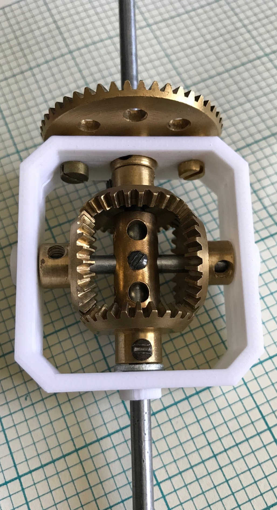
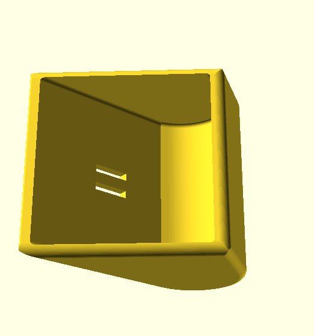
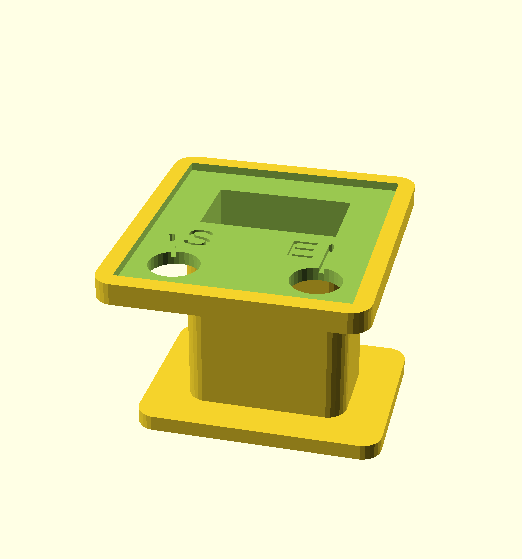

# Meccano Parts

3D printable designs for Meccano and compatible parts

Folder | Description
------ | -----------
bearings | Ball bearings based around part 168
crane-sprocket | Sprockets and idlers for large track system
 | Adapters for non Meccano parts and new spins on existing Meccano parts
 | Two different forms of dredger bucket
 | Elektrikit and Electronics sets parts
gears | Assorted gears, large and fine tooth, bevels, multipurpose and rings
 | Meccano hinge pieces sans hinge pin
junior | Plastic/Junior parts
modern-plastic | Modern plastic parts
 | Rack and pinion
 | Crawler track parts
 | All manner of wheels -- road and flanged
