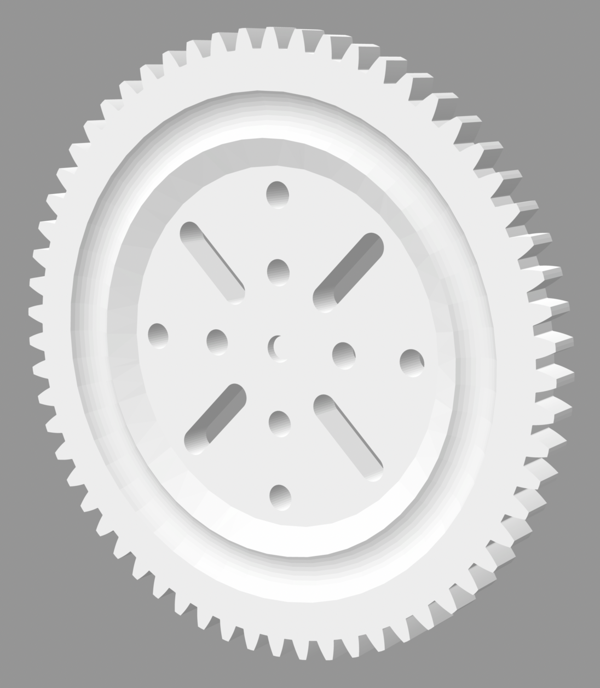
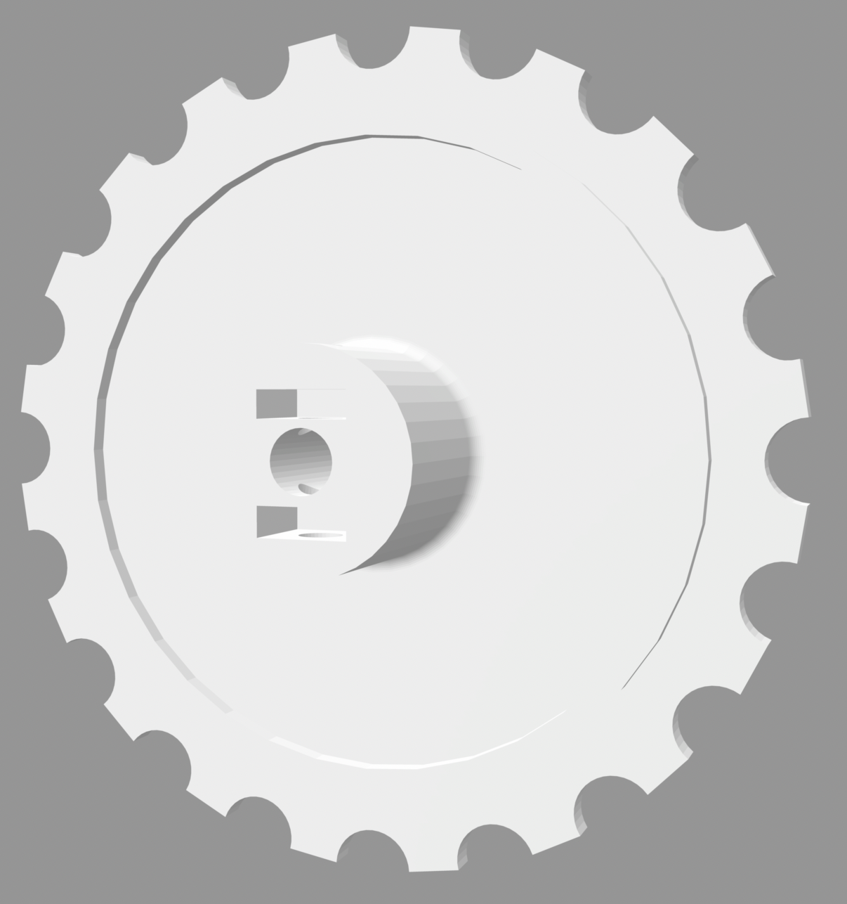
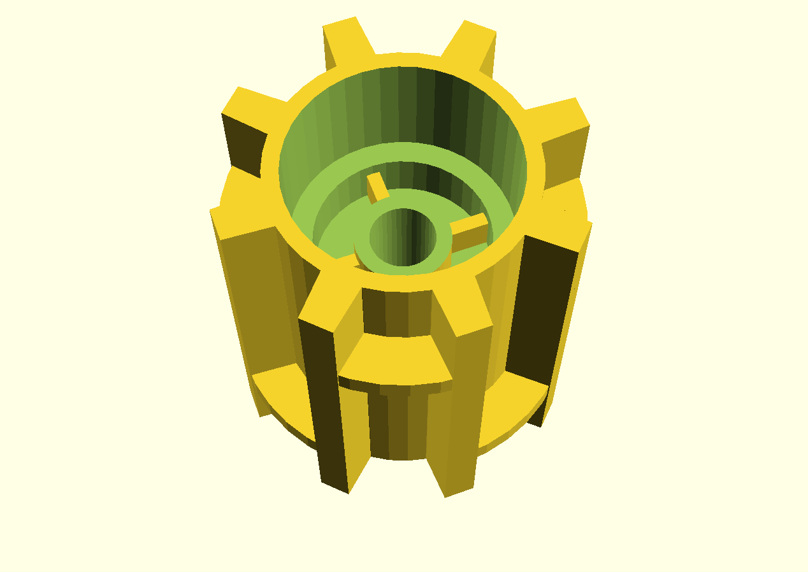
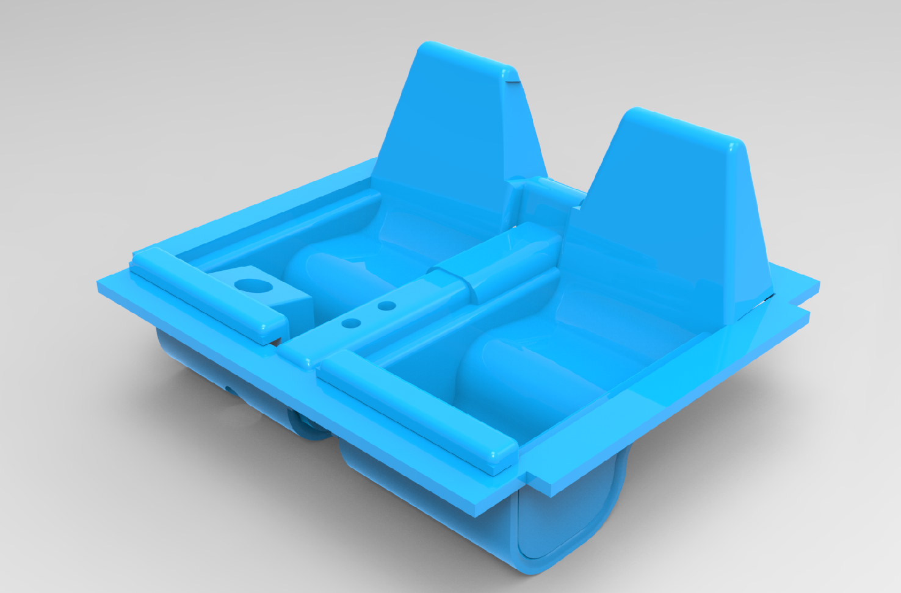
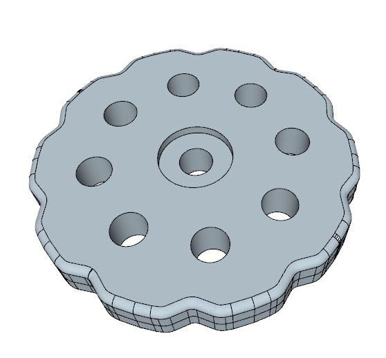

# Meccano Parts

3D printable designs for Meccano and compatible parts

Folder | Description
------ | -----------
 | Ball bearings based around part 168
 | Sprockets and idlers for large track system
 | Adapters for non Meccano parts and new spins on existing Meccano parts
 | Two different forms of dredger bucket
 | Elektrikit, Electronic Control Set and Motor replacement parts
 | Assorted gears, large and fine tooth, bevels, multipurpose, rings and other brass substitutes
 | Meccano hinge pieces sans hinge pin
 | Plastic/Junior parts
 | Modern plastic parts
 | Multikit parts
 | Rack and pinion
 | Crawler track parts
 | All manner of wheels -- road and flanged
 | Tyres for wheels
