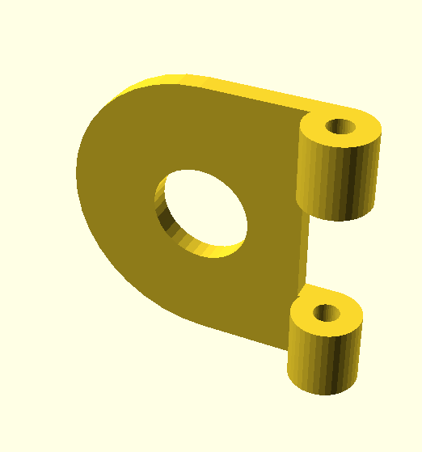
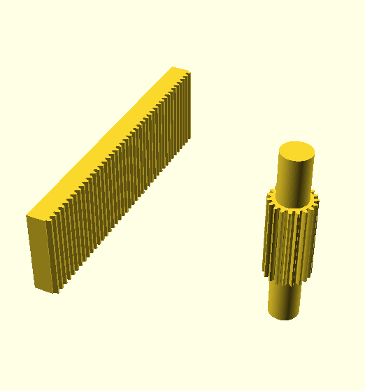
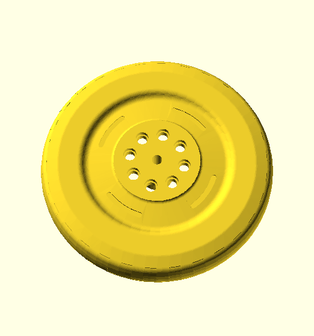

# Meccano Parts

3D printable designs for Meccano and compatible parts

Folder | Description
------ | -----------
[bearings](parts/bearings#readme) | Ball bearings based around part 168
[crane-sprocket](parts/crane-sprocket#readme) | Sprockets and idlers for large track system
 | Adapters for non Meccano parts and new spins on existing Meccano parts
 | Two different forms of dredger bucket
 | Elektrikit and Electronics sets parts
 | Assorted gears, large and fine tooth, bevels, multipurpose and rings
 | Meccano hinge pieces sans hinge pin
[junior](parts/junior#readme) | Plastic/Junior parts
[modern-plastic](parts/modern-plastic#readme) | Modern plastic parts
 | Rack and pinion
 | Crawler track parts
 | All manner of wheels -- road and flanged
 | Tyres for wheels
