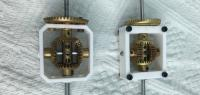
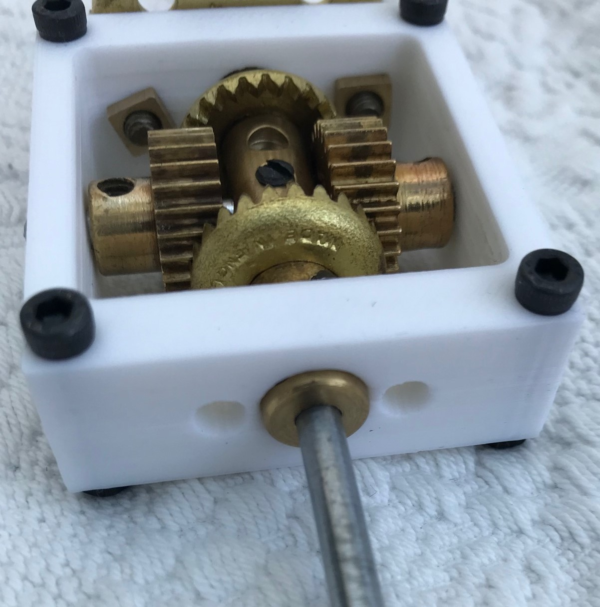
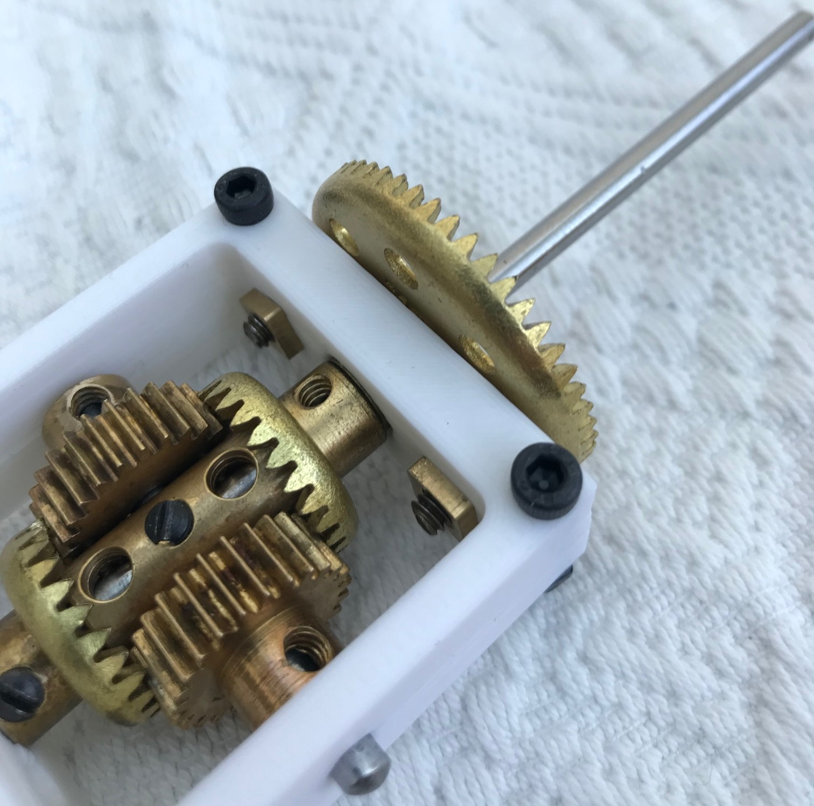

# A collection of differential cages.

Prefix | Description | By
:--- | :--- | :---
 | A [differential cage using bevels](stl/bevel-cage.stl) | Steven Terrell
 | A [differential cage using contrates](stl/contrate-cage.stl) | Steven Terrell

## Bevel Differential

This is a single print version with no supports. Some of the holes
may need tidying up depending upon your printer.

The large bevel is spaced from the frame by 2 thin washers on each
bolt allowing a little movement on the inner bevel.  On the other
sub shaft a normal washer is used to space the bevel from the frame.
The short axle is held in place by the grub screw in the coupling.
Position the sub axles on their small contrates such that the axles
are not pressed tightly against the short axle in the coupling.
Use small hexagonal nuts on the inside of the large bevel.  A little
tweaking should produce a reliable non binding differential that
runs smoothly.

## Contrate Differential

First some notes and pictures

A collar is used as a bearing. It should be "about" flush on the
inside of the frame so it does not put pressure on the internal
contrate - but also not too loose. Fit this before bolting the parts
together.

The drive gear can be a contrate or bevel. The boss is through the
frame. Also just about flush with the inside. Thin washers are used
to space the gear from the frame so that pressure is not applied
on the internal contrate by the boss.

The frame is made from two identical parts held together with M3
nuts and bolts. This was a bit of an experiment to improve some of
the holes in the frame.

The short axle should also be put in place before bolting the frame
together. It is then held by the central screw on the coupling.
You may need to open out the axle hole slightly depending upon how
undersized your printer makes the holes.

