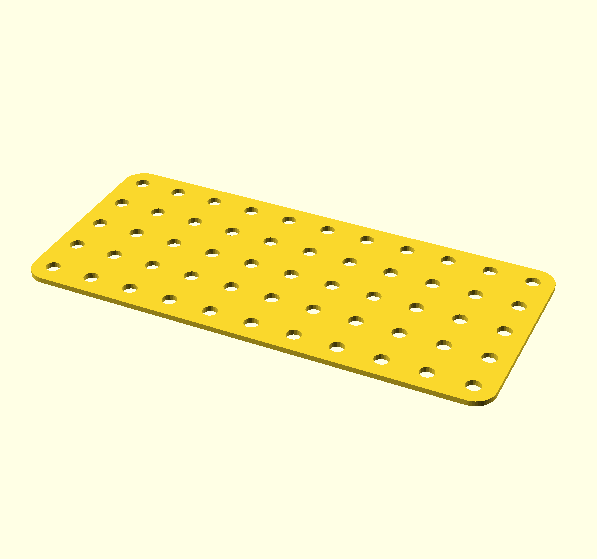
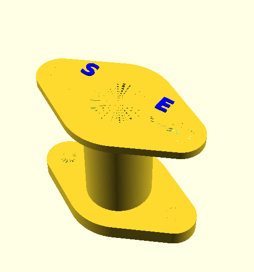
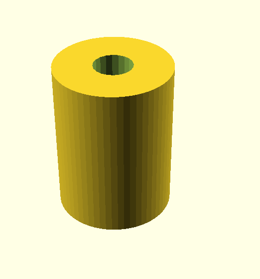

A collection of Elektrikit and Electronic set parts.

Image | Part | Description | By
:--- | :--- | :--- | :---
 | 510 | Insulating flat plate 5x11 | mecparts
 | 511 | Insulating flat plate 5x5 | mecparts
 | 520 | Rectangular Coil former | mecparts
 | 522 | Cylindrical Coil former | mecparts
 | 564 | Insulating spacer (no threads) | mecparts
 | 606 | Relay fixing plate | mecparts
 |     | Microswitch mounting plate for KW4A(S) or CamdenBoss CSM3510D microswitch | Stephen Terrel
