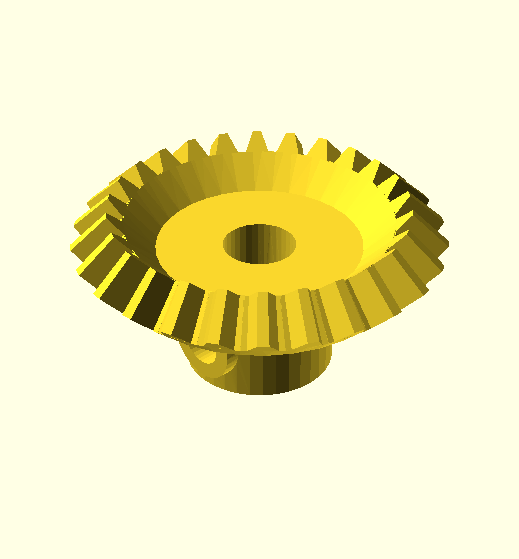
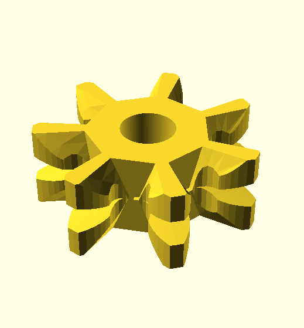

This directory contrains gears of varying kinds.

Kind | Description
---- | -----------
 | [Bevel gears](bevel) with Meccano standard teeth
large-tooth | Large toothed gears, quadrants and worms using 16 DP
maker | DXF and SCAD files for producing gears, no directly printable designs
 | [Multipurpose Special tooth form 14 DP gears](multipurpose) allowing mesh at any angle
 | [Meccano standard 38 DP gears and pinions](standard)
