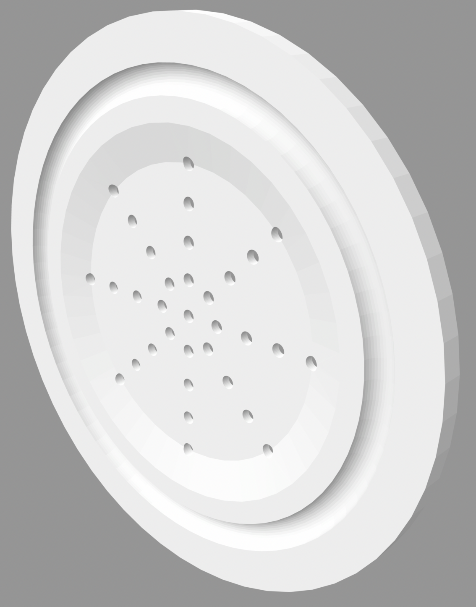
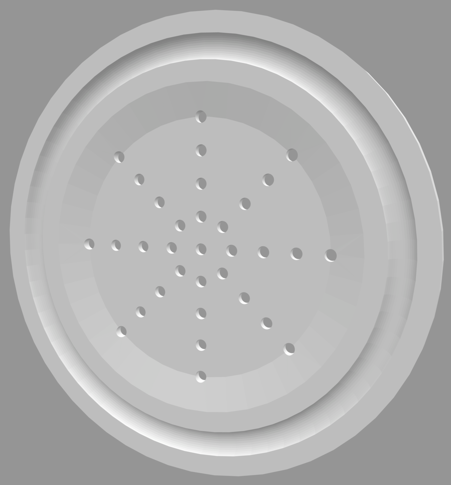
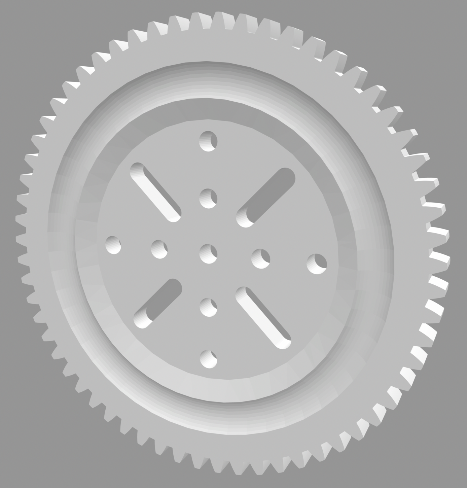
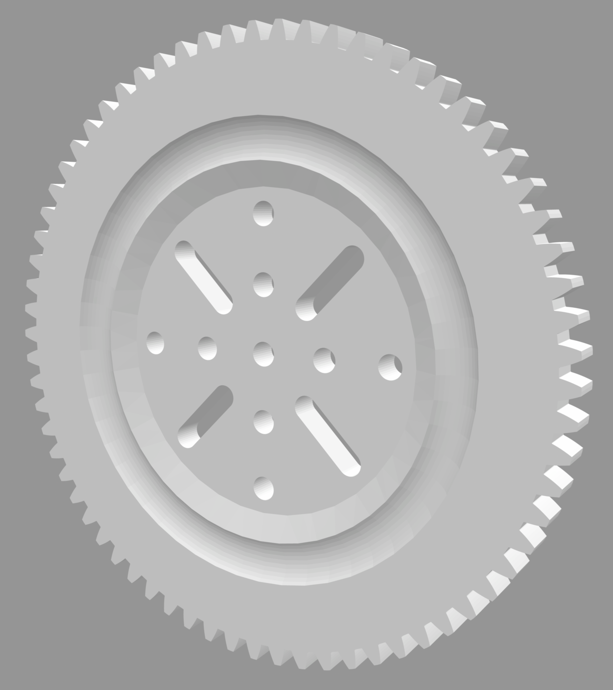
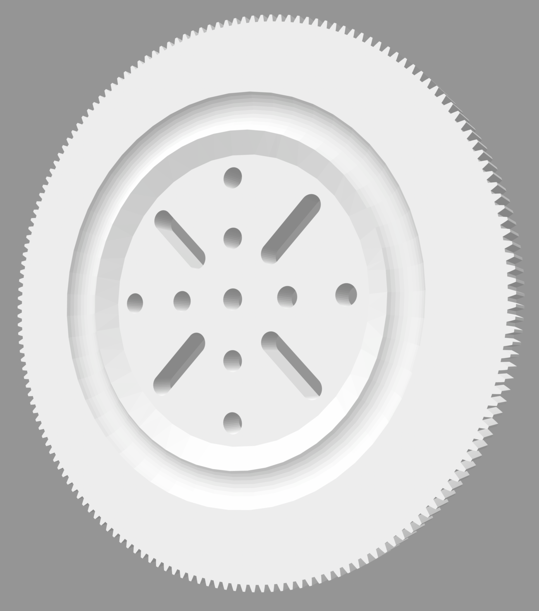
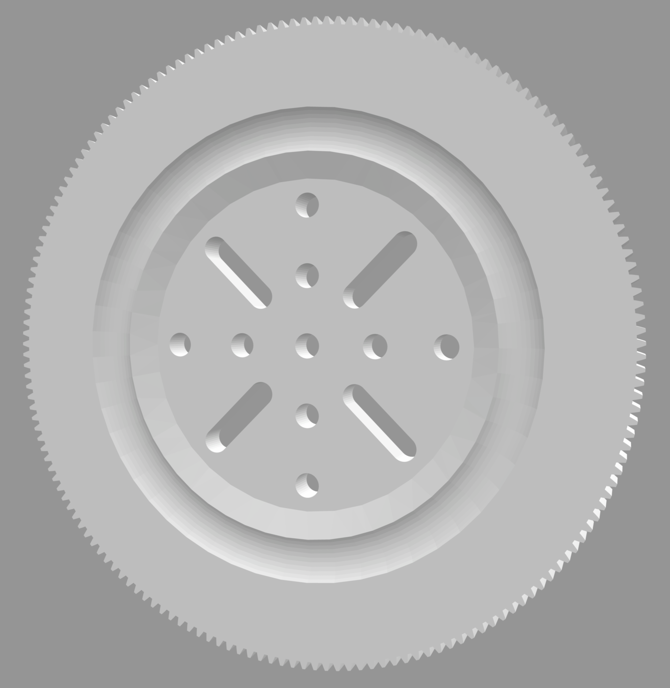

A collection of bearings based around part 168.  A variety of diffent
toothed discs are available allowing for both 16 and 38 DP drives.
Most of these require a Ball Cage (part 168c) to operate.

Image | Description | By
----- | ----------- | --
 | Big Bearing Bottom | Grendel
 | Big Bearing Top | Grendel
 | Part 168 with 16DP 61T - Raft | Grendel
 | Part 168 with 16DP 61T | Grendel
 | Part 168 with 16DP 68T | Grendel
 | Part 168 with 38DP 171 tooth raft | Grendel
 | Part 168 with 38DP 171 tooth | Grendel
