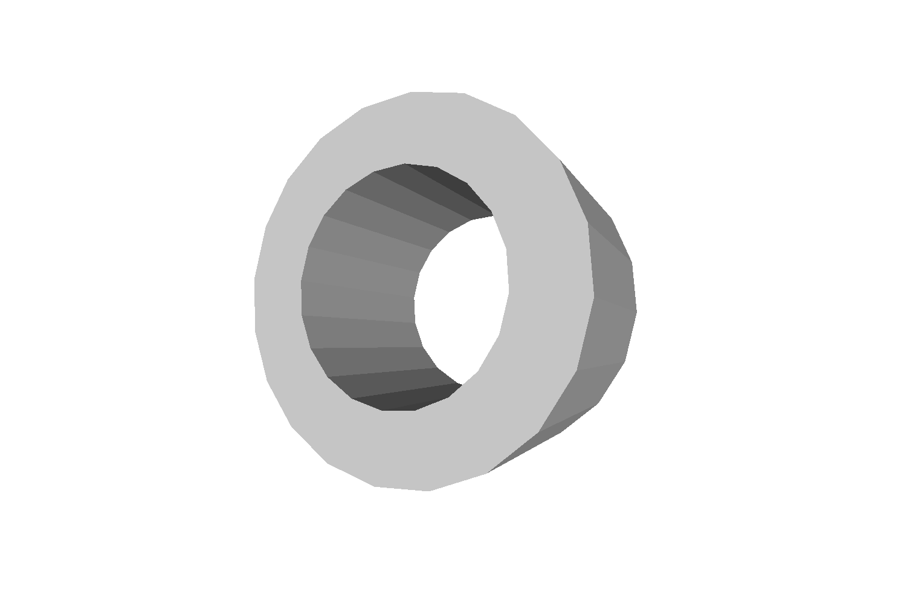
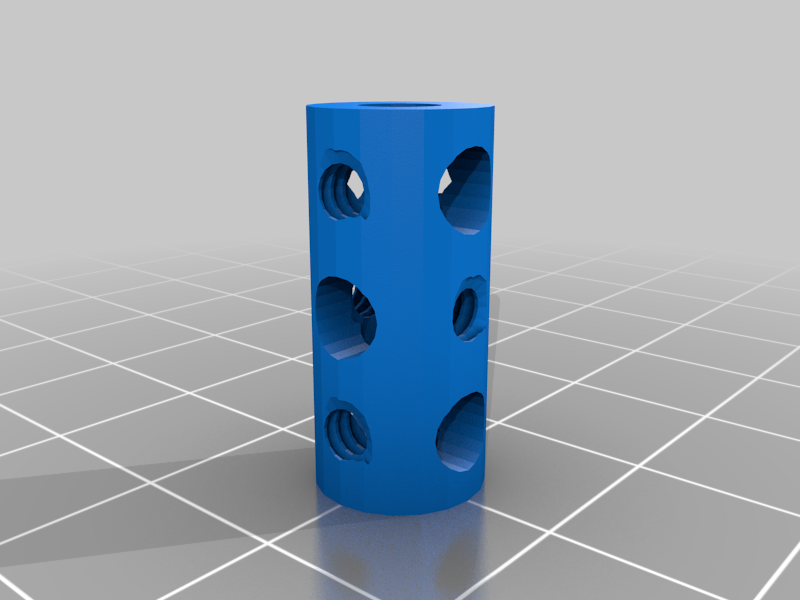
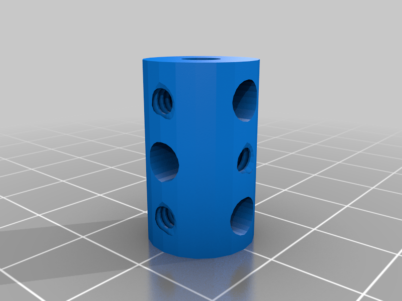
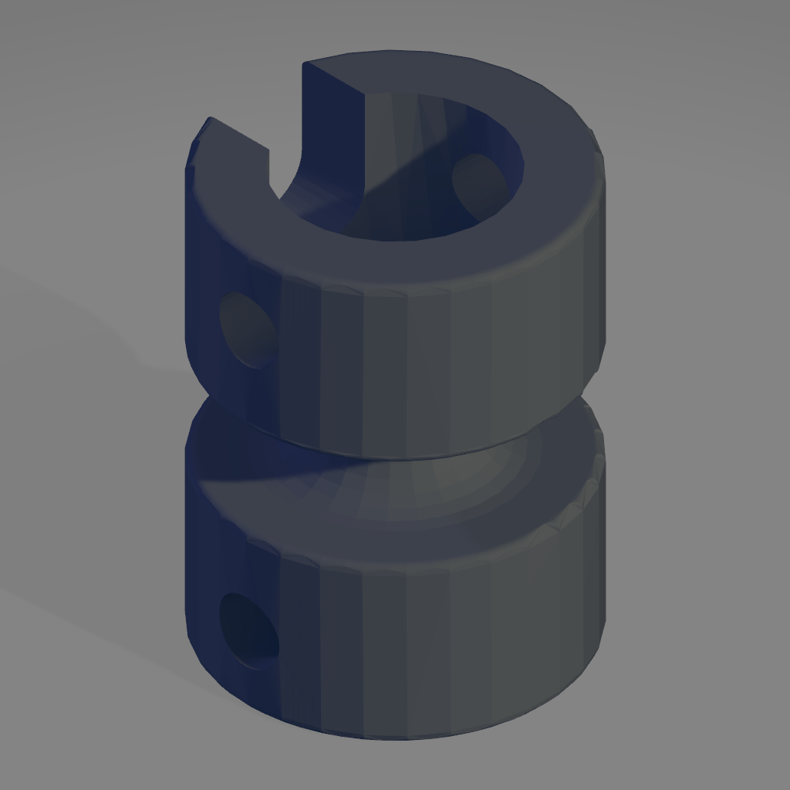

This directory contains brassware replacements.

Image | Part | Description | Creator
----- | ---- | ----------- | -------
 | [59](stl/59-collar.stl) | [Collar](stl/59-collar.stl) | [Dave Burrell](https://www.thingiverse.com/thing:5491271)
 | | [Friction stop for plastic collar](stl/center_piece.stl) | Dave Burrell
 | | [Plastic collar](stl/center_piece_collar.stl) | Dave Burrell
 | [63](stl/63-coupling.stl) | [Coupling](stl/63-coupling.stl) | [Dave Burrell](https://www.thingiverse.com/thing:5403075)
 | | [Wide coupling](stl/63-coupling-wide.stl) | [Dave Burrell](https://www.thingiverse.com/thing:5403075)
 | [63c](stl/63c-threaded-coupling.stl) | [Threaded coupling](stl/63c-threaded-coupling.stl) | [Dave Burrell](https://www.thingiverse.com/thing:5419427)
 | [171](stl/171_socket_coupling.stl) | Socket coupling [(FreeCAD)](freecad/171_socket_coupling.FCStd) | aliotard
