# A collection of custom parts.

Here you will find adapters for non Meccano parts and new takes on existing Meccano parts.

Prefix | Description | By
:--- | :--- | :---
 | &frac12;" cubes | Ed Vegia
 | Differential cages | Steven Terrell
 | Collar pillow block | Steven Terrell
 | An adapter plate for mounting an Arduino Uno ([SCAD](scad/Arduino_mounting_plate.scad), [DXF](dxf/Arduino_mounting_plate_Meccano_logo.dxf))| mecparts
[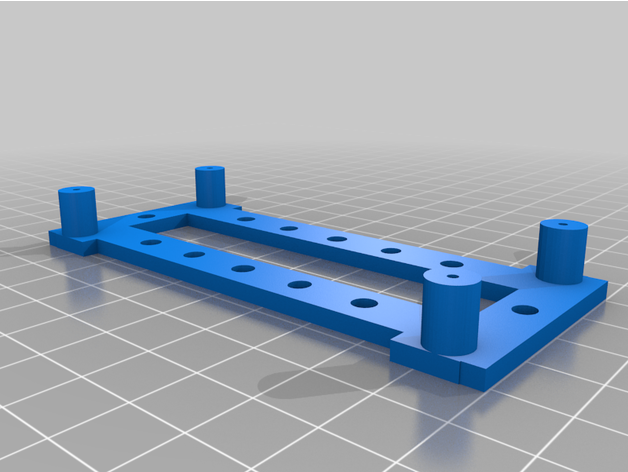](stl/stereopi_v1.stl) | Raspberry Pi mounting plate (version 1) | [Dave Burrell](https://www.thingiverse.com/thing:5217911)
[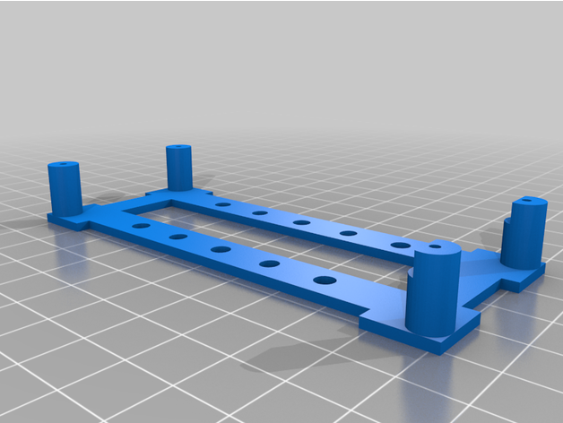](stl/stereopi_mount.stl) | Raspberry Pi mounting plate | [Dave Burrell](https://www.thingiverse.com/thing:5207817)
[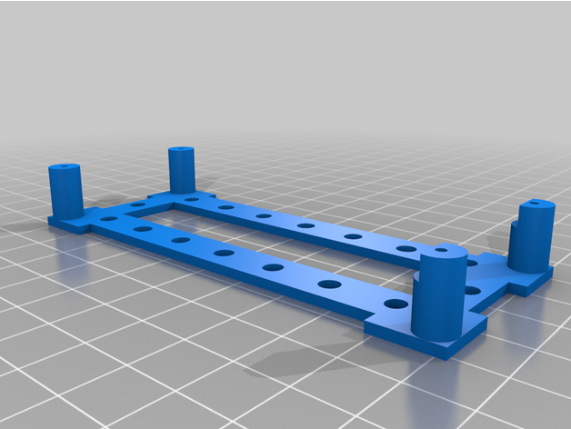](stl/stereopi_holey_mount.stl) | Raspberry Pi mounting plate (end holes) | [Dave Burrell](https://www.thingiverse.com/thing:5207817)
 | A parameterised adapter plate for mounting a 28BYJ-48 stepper motor ([SCAD](scad/28BYJ-48_mounting_plate.scad)) | mecparts
 | A 4x5 adapter plate for mounting a 28BYJ-48 stepper motor | mecparts
 | A 5x7 adapter plate for mounting a 28BYJ-48 stepper motor | mecparts
 | A 5x9 adapter plate for mounting a 28BYJ-48 stepper motor | mecparts
 | Holder for 9V battery with end mounting holes | mecparts
 | Holder for 9V battery with side mounting holes | mecparts
[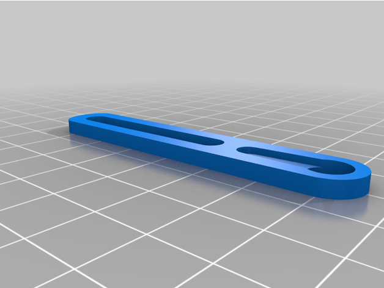](stl/sg90_slotted_strip.stl) | Slotted arm for SG90 servo | [Dave Burrell](https://www.thingiverse.com/thing:5029828)
[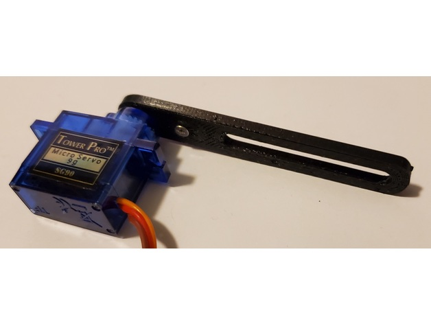](stl/sg90_slotted_strip_1_2.stl) | Slotted arm for SG90 servo | [Dave Burrell](https://www.thingiverse.com/thing:5029828)
[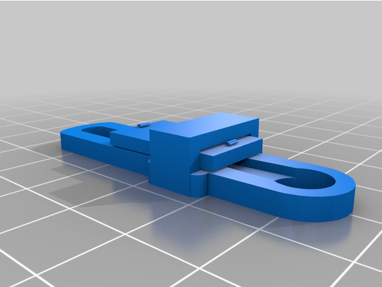](stl/sg90_locking_slotted_strip.stl) | Locking slotted arm for SG90 servo | [Dave Burrell](https://www.thingiverse.com/thing:5226420)
[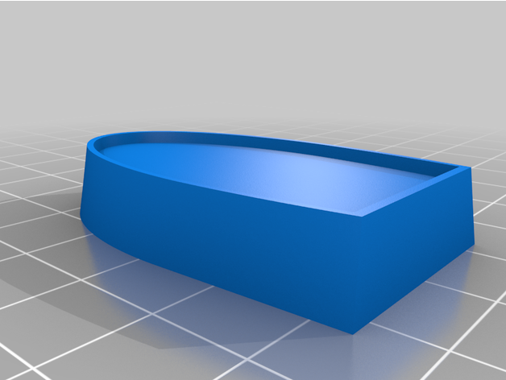](stl/bugatti_t35_radiator_model33.stl) | Bugatti T35 Radiator for Meccano model #33 | [Dave Burrell](https://www.thingiverse.com/thing:5087612)

## Raspberry Pi Mounting Plate

[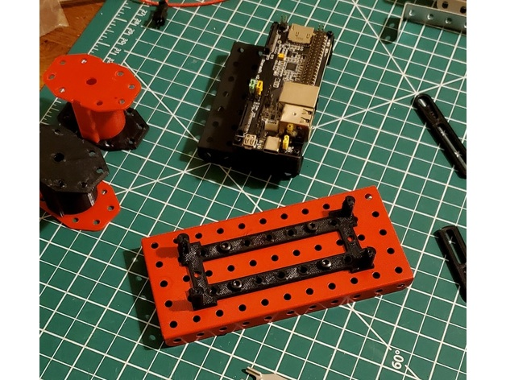](images/stereopi_mount.jpg)

## SG90 Locking Slotted Strip

[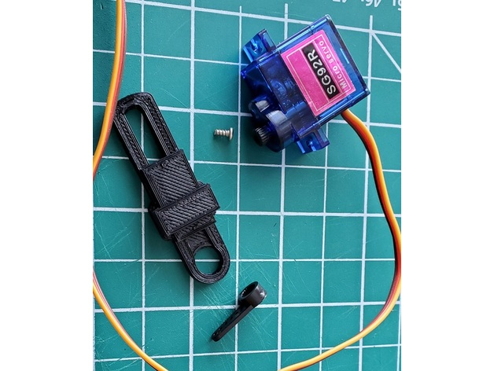](images/sg90_locking_slotted_strip1.jpg)
[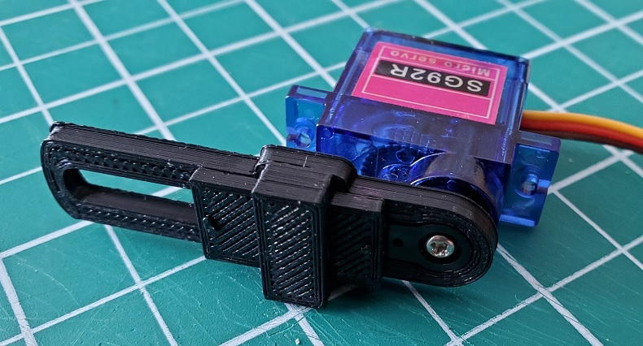](images/sg90_locking_slotted_strip2.jpg)
[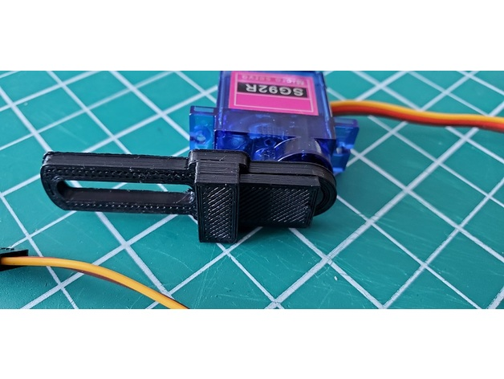](images/sg90_locking_slotted_strip3.jpg)

## Bugatti T35 Radiator for Meccano model #33

[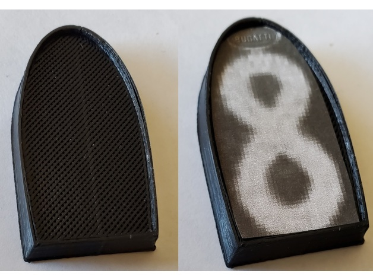](images/bugatti_t35_radiator_model33.jpg)
