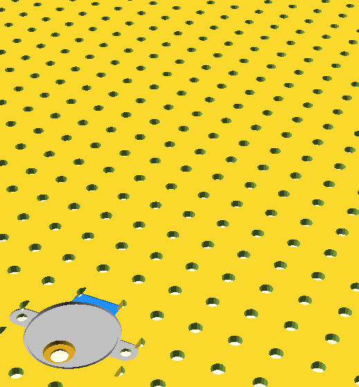
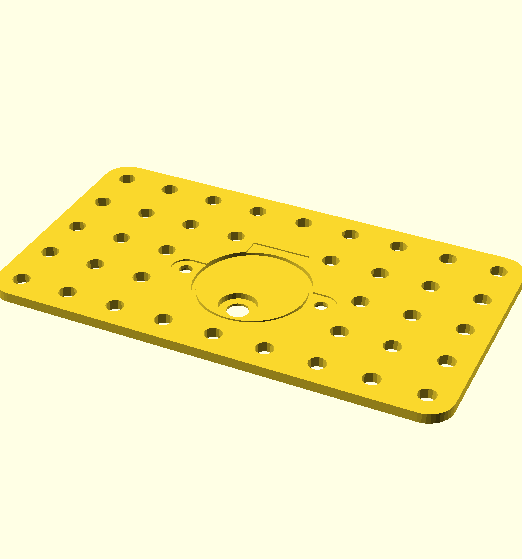
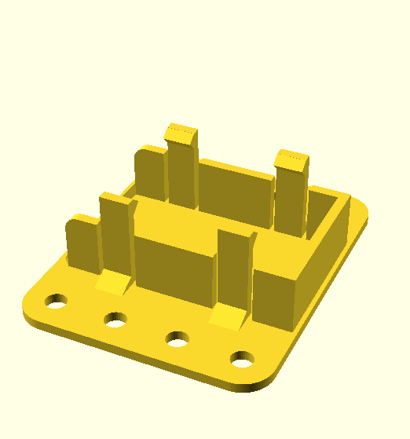

A collection of custom parts. Here you will find adapters for non Meccano parts and new takes on existing Meccano parts.

Prefix | Description | By
:--- | :--- | :---
 | &frac12;" cubes | Ed Vegia
 | Differential cages | Steven Terrell
 | Collar pillow block | Steven Terrell
 | An adapter plate for mounting an Arduino Uno ([SCAD](scad/Arduino_mounting_plate.scad), [DXF](dxf/Arduino_mounting_plate_Meccano_logo.dxf))| mecparts
 | A parameterised adapter plate for mounting a 28BYJ-48 stepper motor ([SCAD](scad/28BYJ-48_mounting_plate.scad)) | mecparts
 | A 4x5 adapter plate for mounting a 28BYJ-48 stepper motor | mecparts
 | A 5x7 adapter plate for mounting a 28BYJ-48 stepper motor | mecparts
 | A 5x9 adapter plate for mounting a 28BYJ-48 stepper motor | mecparts
 | Holder for 9V battery with end mounting holes | mecparts
 | Holder for 9V battery with side mounting holes | mecparts

