# A collection of electrical related parts

This includes:

* Elektrikit
* Electronic Control Set
* Replacement motor mounts

Image | Part | Description | By
:--- | :--- | :--- | :---
&nbsp; | [5xx](scad/5xx_insulating_plates.scad) | Insulating flat plate any size [(SCAD)](scad/5xx_insulating_plates.scad) | mecparts
[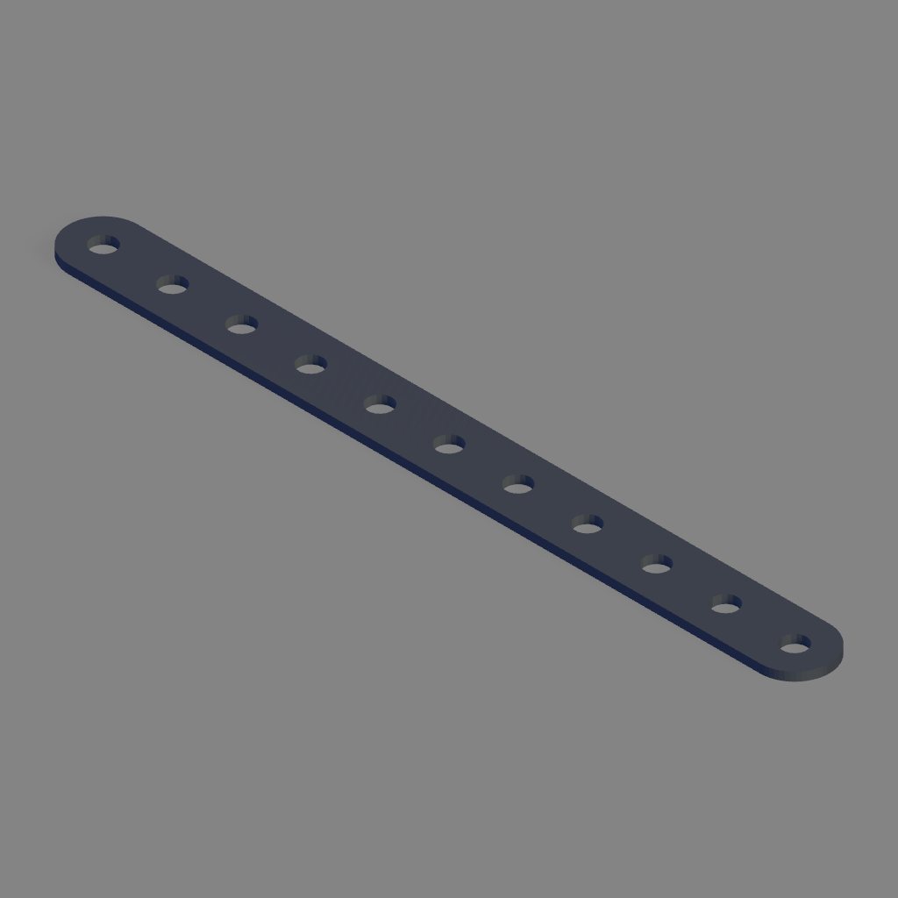](stl/501_insulating_strip_11_holes.stl) | [501](stl/501_insulating_strip_11_holes.stl) | Insulating strip 11 holes | aliotard
[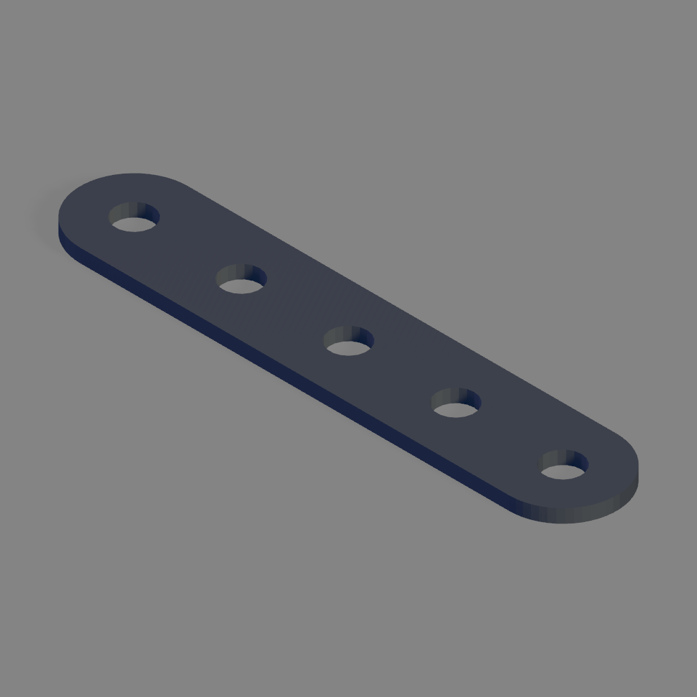](stl/502_insulating_strip_5_holes.stl) | [502](stl/502_insulating_strip_5_holes.stl) | Insulating strip 5 holes | aliotard
[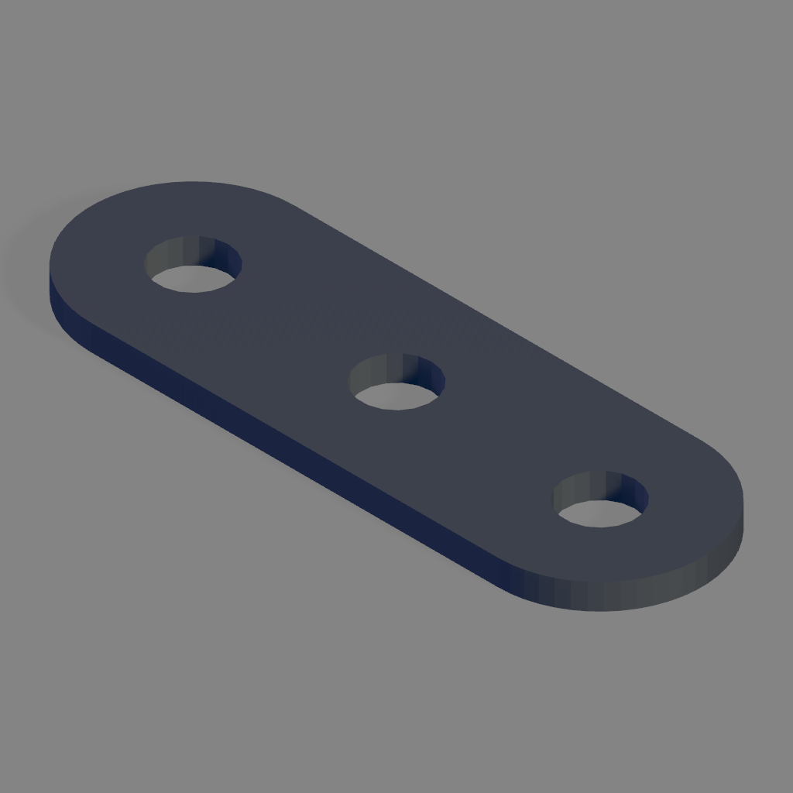](stl/503_insulating_strip_3_holes.stl) | [503](stl/503_insulating_strip_3_holes.stl) | Insulating strip 3 holes | aliotard
 | [510](stl/510_insulating_flat_plate_5x11.stl) | Insulating flat plate 5x11 | mecparts
[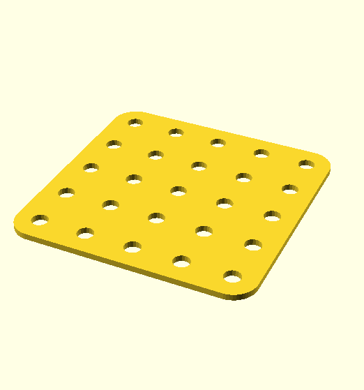](stl/511_insulating_flat_plate_5x5.stl) | [511](stl/511_insulating_flat_plate_5x5.stl) | Insulating flat plate 5x5 | mecparts
[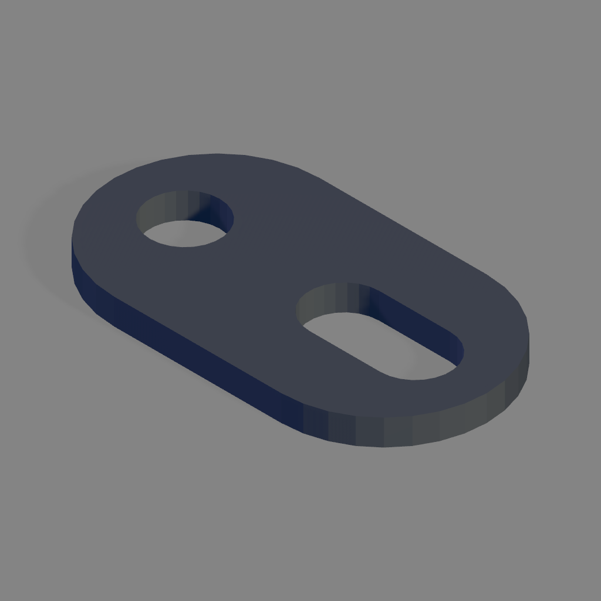](stl/513_insulating_fish_plate.stl) | [513](stl/513_insulating_fish_plate.stl) | Insulating fish plate [(FreeCAD)](freecad/513_insulating_fish_plate.FCStd) | aliotard
[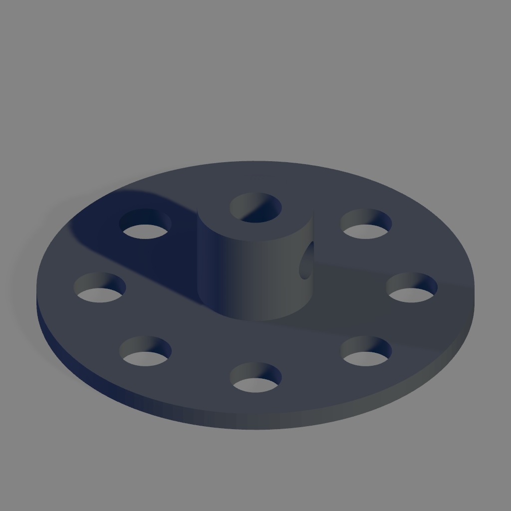](stl/514_insulating_bush_wheel_8_holes.stl) | [514](stl/514_insulating_bush_wheel_8_holes.stl) | Insulating bush wheel 8 holes (grub screw hole must be tapped with 5/32-32 BSW tap) [(FreeCAD)](freecad/514_insulating_bush_wheel_8_holes.FCStd) | aliotard
[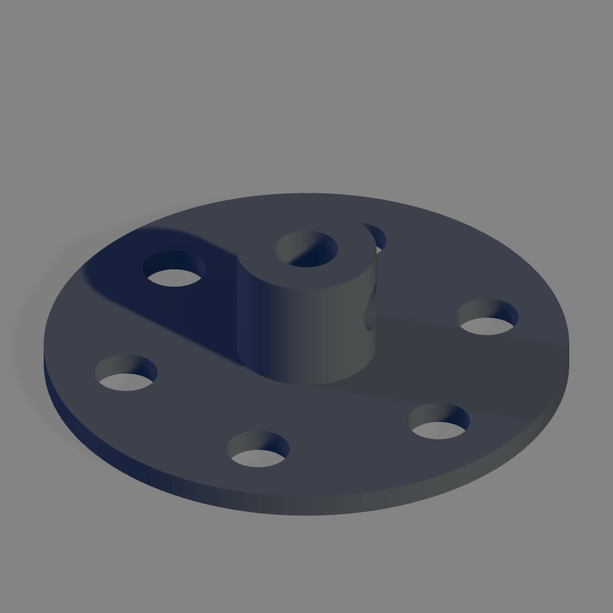](stl/516_insulating_bush_wheel_6_holes.stl) | [516](stl/516_insulating_bush_wheel_6_holes.stl) | Insulating bush wheel 6 holes (grub screw hole must be tapped with 5/32-32 BSW tap) [(FreeCAD)](freecad/516_insulating_bush_wheel_6_holes.FCStd) | aliotard
 | [520](stl/520_rectangular_coil_former.stl) | Rectangular Coil former [(SCAD)](scad/520_rectangular_coil_former.scad) | mecparts
 | [522](stl/522_cylindrical_coil_former.stl) | Cylindrical Coil former [(SCAD)](scad/522_cylindrical_coil_former.scad) | mecparts
[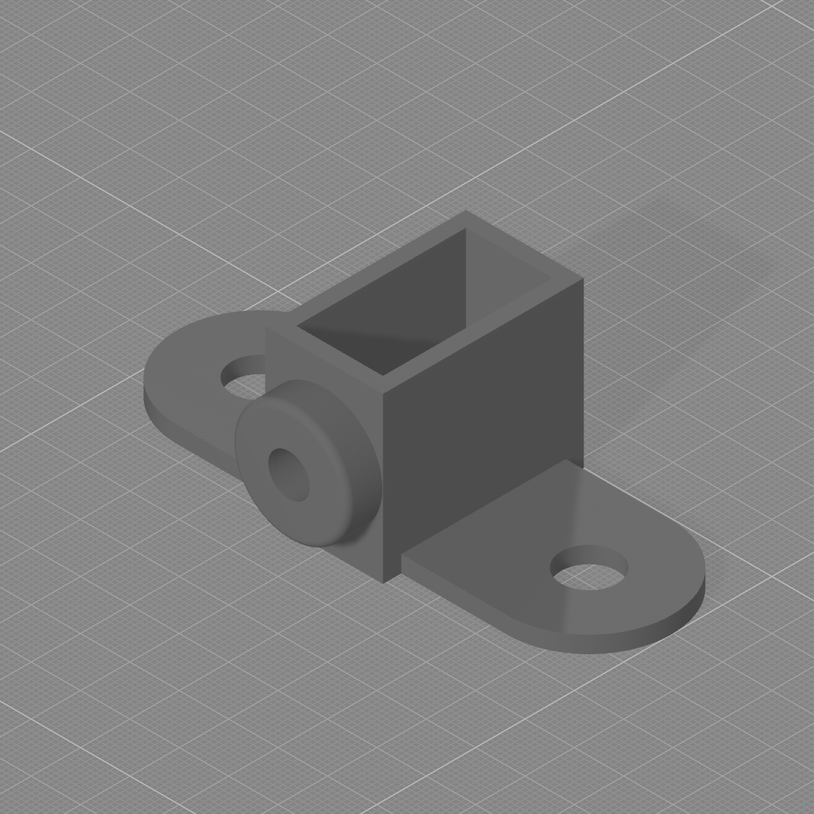](stl/538_magnet_holder.stl) | [538](stl/538_magnet_holder.stl) | Magnet holder (set screw hole must be tapped with 5/32-32 BSW tap) [(FreeCAD)](freecad/538_magnet_holder.FCStd) | aliotard
 | [564](stl/564_insulated_spacer_no_threads.stl) | Insulating spacer (no threads) [(SCAD)](scad/564_insulated_spacer.scad) | mecparts
[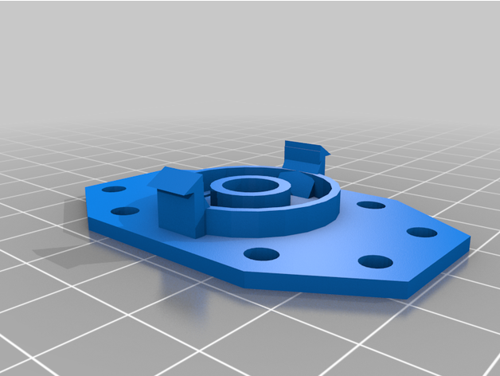](stl/600_motor_case_a.stl) | [600](stl/600_motor_case_a.stl) | Motor case - end | [Dave Burrell](https://www.thingiverse.com/thing:5187950/files)
[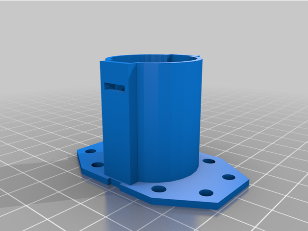](stl/600_motor_case_b.stl) | [600](stl/600_motor_case_b.stl) | Motor case - body | [Dave Burrell](https://www.thingiverse.com/thing:5187950/files)
[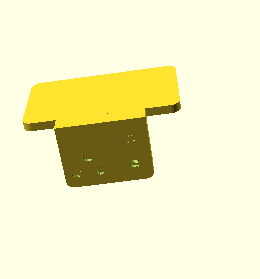](stl/606_relay_fixing_plate.stl) | [606](stl/606_relay_fixing_plate.stl) | Relay fixing plate [(SCAD)](scad/606_relay_fixing_plate.scad) | mecparts
[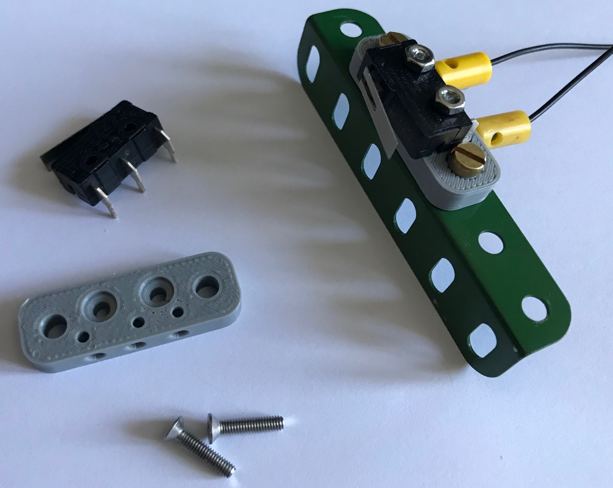](stl/microswitch_plate.stl) |     | Microswitch mounting plate for KW4A(S) or CamdenBoss CSM3510D microswitch | Stephen Terrel

More images of the motor mounting plate in action:

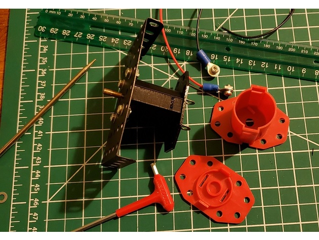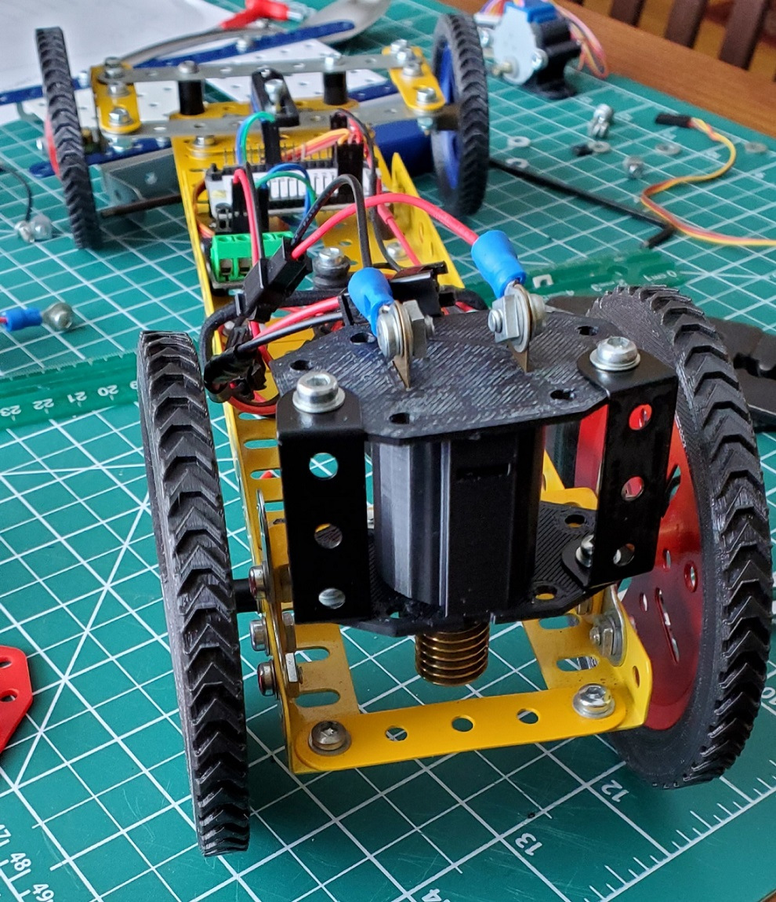
