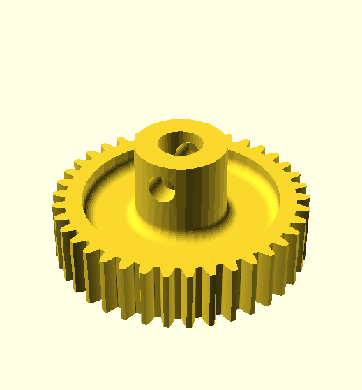

This directory contrains gears of varying kinds.

Kind | Description
---- | -----------
 | [Bevel gears](bevel#readme) with Meccano standard teeth
[large-tooth](large-tooth#readme) | [Large toothed gears, quadrants and worms using 16 DP](large-tooth#readme)
 | [DXF and SCAD files for producing gears](maker#readme), no directly printable designs
 | [Multipurpose Special tooth form 14 DP gears](multipurpose#readme) allowing mesh at any angle
 | [Meccano standard 38 DP gears and pinions](standard#readme)
