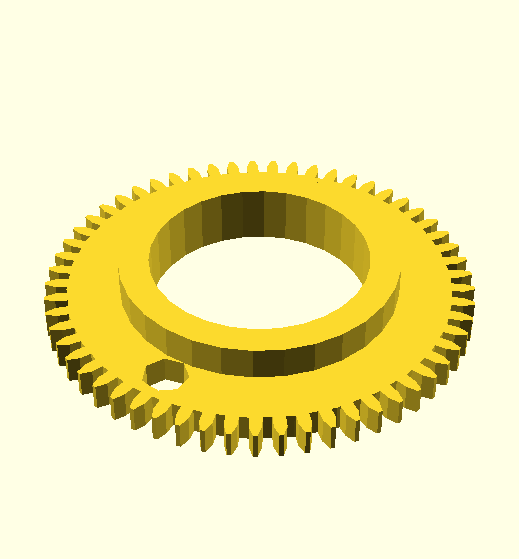
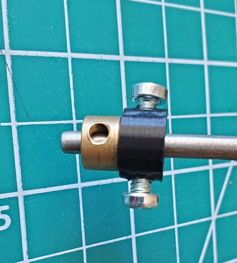
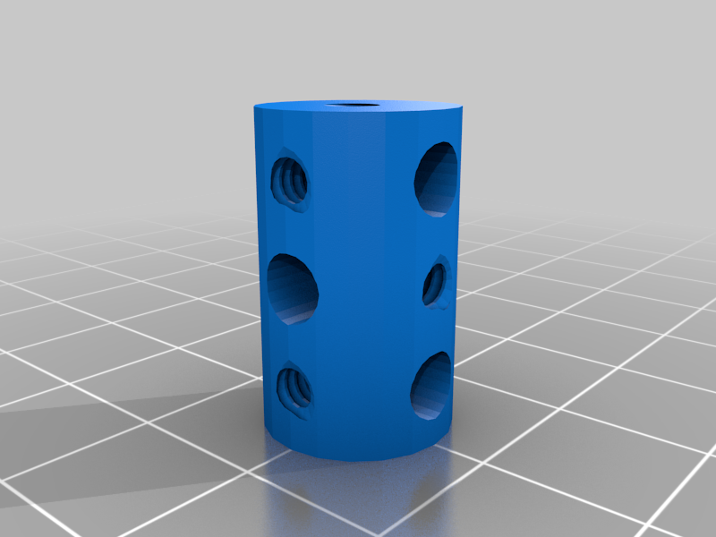

This directory contrains gears of varying kinds.

Kind | Description | Creator
---- | ----------- | -------
 | [Bevel gears](bevel#readme) with Meccano standard teeth
 | [Large toothed gears, quadrants and worms using 16 DP](large-tooth#readme)
 | [DXF and SCAD files for producing gears](maker#readme), no directly printable designs
 | [Multipurpose Special tooth form 14 DP gears](multipurpose#readme) allowing mesh at any angle
 | [Meccano standard 38 DP gears and pinions](standard#readme)
 | [57 tooth ring for French Knitting Machine](stl/57t-ring-for-FKM.stl) ([SCAD](scad/57t-ring-for-FKM.scad)) | John Stark
 | [Collar](stl/59-collar.stl) | [Storming Moose](https://www.thingiverse.com/thing:5491271)
 | [Coupling](stl/63-coupling.stl) | [Storming Moose](https://www.thingiverse.com/thing:5403075)
 | [Wide coupling](stl/63-coupling-wide.stl) | [Storming Moose](https://www.thingiverse.com/thing:5403075)
 | [Threaded coupling](stl/63c-threaded-coupling.stl) | [Storming Moose](https://www.thingiverse.com/thing:5419427)
