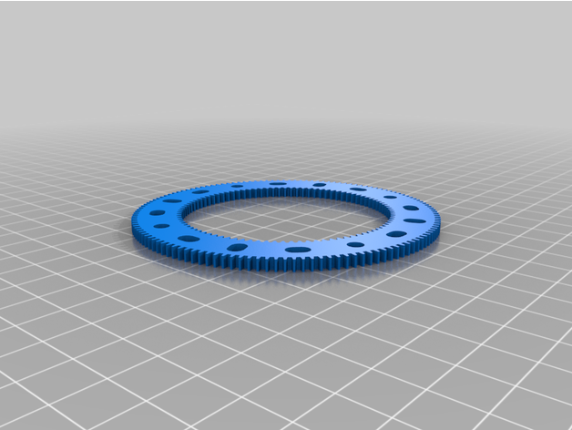
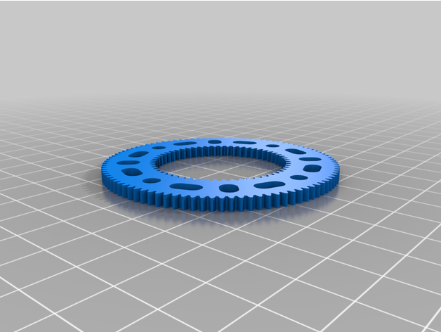

# Meccano gear rings

38 DP gear rings

Image | Teeth | Part | Description | Creator
----- | ----- | ---- | ----------- | -------
 | [95 / 133](stl/180.stl) | [180](stl/180.stl) | [Gear Ring 95 / 133 (standard)](stl/180.stl) | [Dave Burrell](https://www.thingiverse.com/thing:6083424)
 | [57 / 95](stl/180a.stl) | [180a](stl/180a.stl) | [Gear Ring 57 / 95](stl/180a.stl) | [Dave Burrell](https://www.thingiverse.com/thing:6086686)
