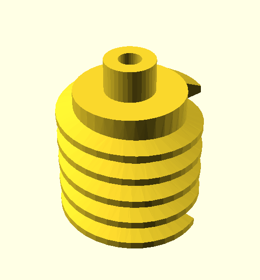
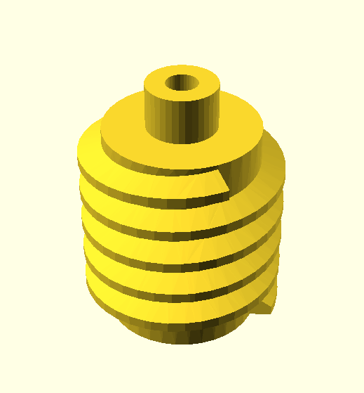
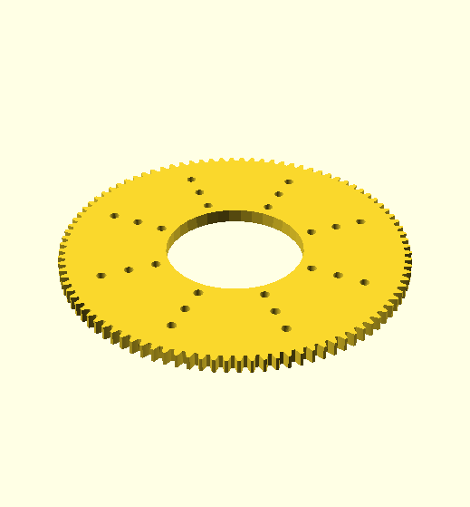
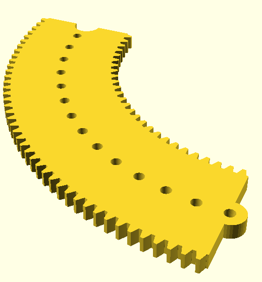
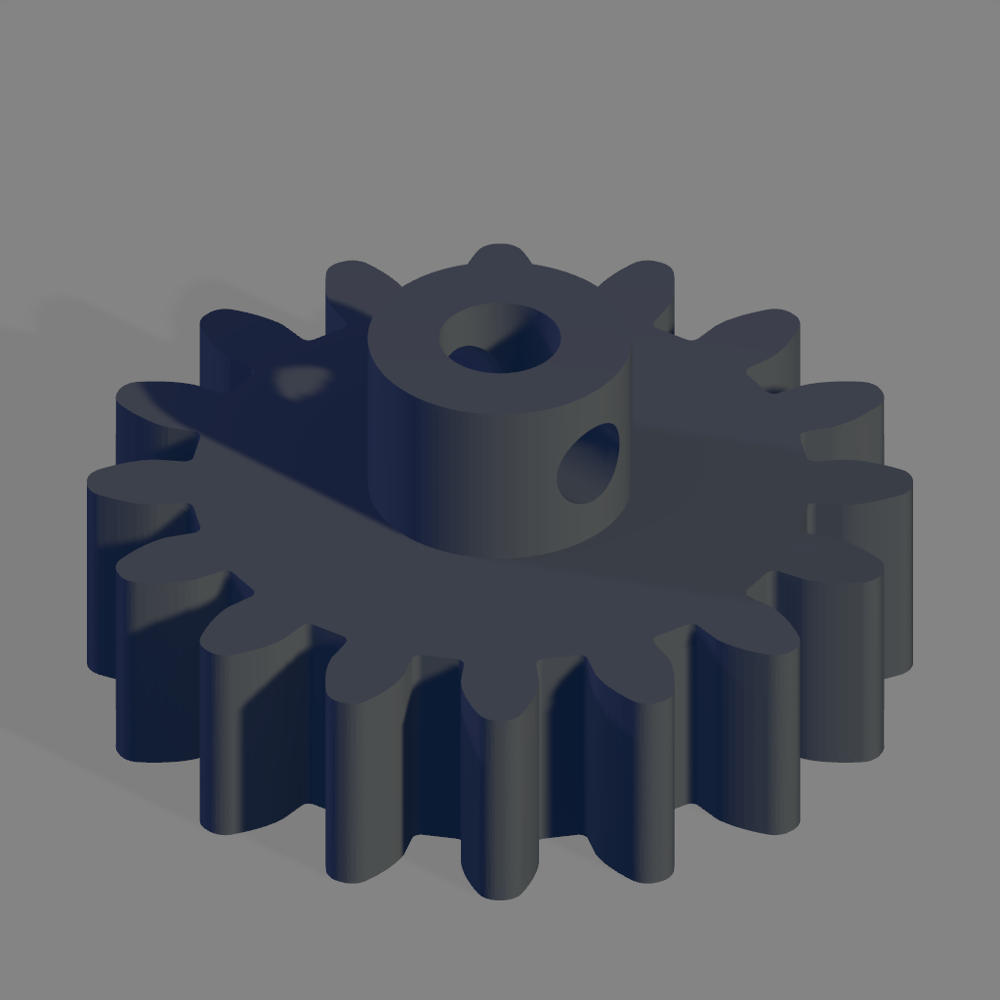
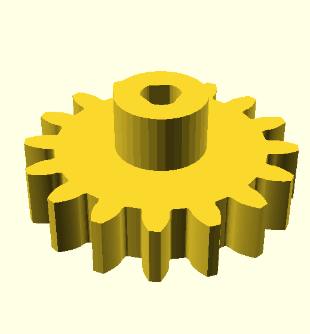
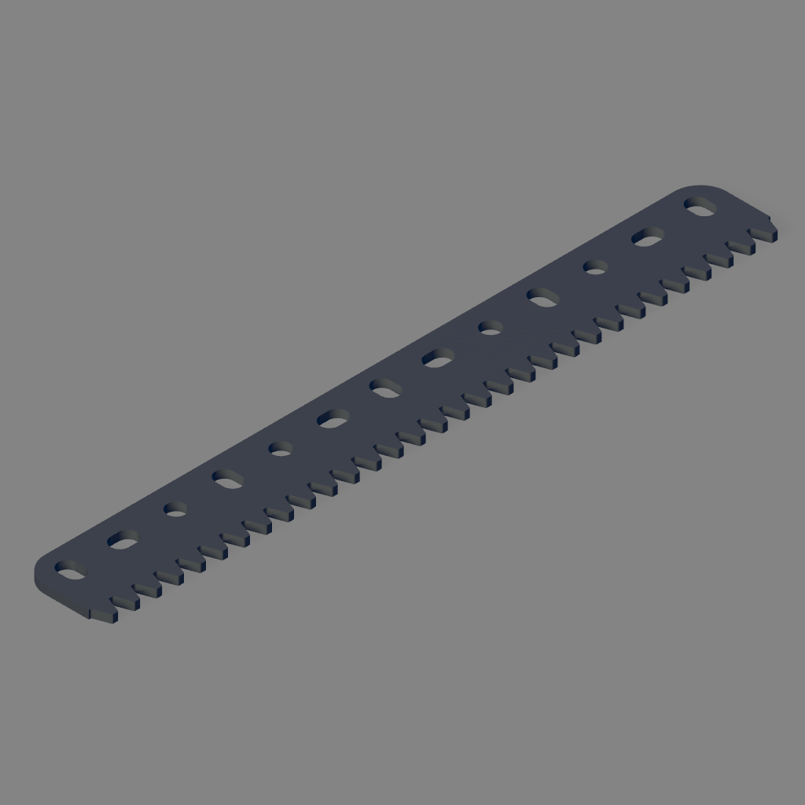
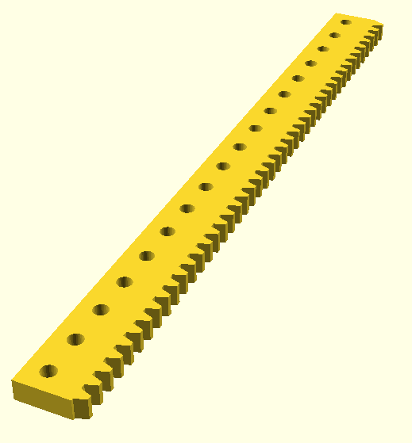

# Meccano large tooth 16 DP gears

Image | Part | Description | Creator
----- | ---- | ----------- | -------
 |  |[Left handed worm](stl/16DP-LH-worm.stl) | Grendel
 |  |[Right handed worm](stl/16DP-RH-worm.stl) | Grendel
 |  |[Large tooth 96 tooth gear ring](stl/96-tooth-16-dp-ring-gear.stl) (three hole width) | Grendel
 | [167a](stl/part-167a-large-gear-quadrant-new-version.stl) | [Large tooth quadrant](stl/part-167a-large-gear-quadrant-new-version.stl) ([SCAD](scad/part-167a-large-gear-quadrant-new-version.scad))| Grendel
 | [167c](stl/167c_geared_roller_bearing_pinion.stl) | Geared roller bearing pinion (grub screw hole must be tapped with 5/32-32 BSW tap) [(FreeCAD)](freecad/167c_geared_roller_bearing_pinion.FCStd) | aliotard
 |  | [Large tooth quadrant pinion tri-flat](stl/part-167c-tri-hole-pinion.stl) | Grendel
 | [167e](stl/167e_large_toothed_rack_13_holes.stl) | Large tooth rack strip 13 holes [(FreeCAD)](freecad/167e_large_toothed_rack_13_holes.FCStd) | aliotard
 |  |[18 hole rack strip](stl/rack-18-hole.stl) | Grendel
