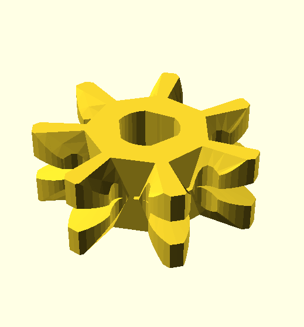
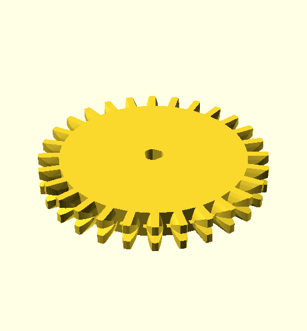
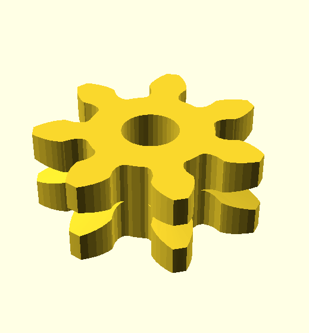

# Meccano multipurpose gears

14 DP gears with special tooth form

Image | Description | Creator
----- | ----------- | ------
 | [Multipurpose pinion 7 tooth round hole](stl/7t-14dp-gear3.stl) | Grendel
 | [Multipurpose pinion 7 tooth tri-flat](stl/7t-14dp-gear3-tri-hole.stl) | Grendel
 | [Multipurpose gear 28 tooth round hole](stl/28t14dp-hole.stl) | Grendel
 | [Multipurpose gear 28 tooth tri-flat](stl/28t14dp-tri-hole.stl) | Grendel
 | [Multipurpose gear 28 tooth splined hole](stl/28t14dp-spline-boss.stl) | Grendel
 | [Multipurpose pinion 7 tooth round hole](stl/7t-14dp-gear2.stl) earlier version | Grendel
 | [Multipurpose pinion 7 tooth round hole](stl/7t-14dp-gear.stl) earlier version | Grendel
