# Meccano mesh gears

38 DP standard gears

Image | Teeth | Part | Description | Creator
----- | ----- | ---- | ----------- | -------
 | [12](stl/12t-hole.stl) | [25c](stl/12t-hole.stl) | [Pinion (early clockwork motors)](stl/12t-hole.stl) | Grendel
 | [13](stl/13t-hole.stl) | [25r](stl/13t-hole.stl) | [Pinion (later clockwork motors)](stl/13t-hole.stl) | Grendel
 | [14](stl/14t-hole.stl) | | [Pinion](stl/14t-hole.stl) | Grendel
[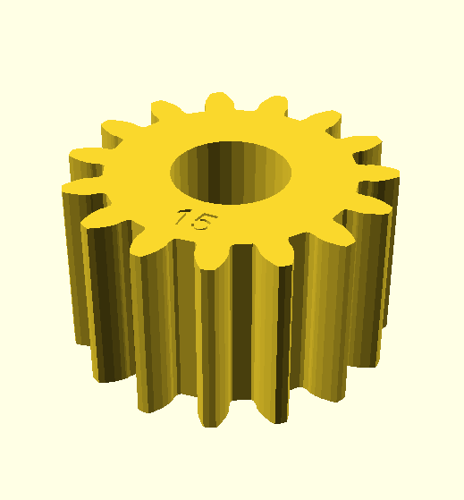](stl/15t-hole.stl) | [15](stl/15t-hole.stl) | [26c](stl/15t-hole.stl) | [Pinion (stardard)](stl/15t-hole.stl) | Grendel
[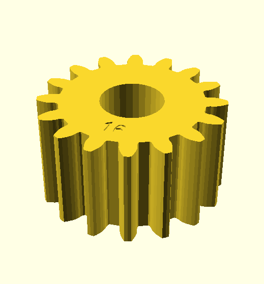](stl/16t-hole.stl) | [16](stl/16t-hole.stl) | [26g](stl/16t-hole.stl) | [Pinion](stl/16t-hole.stl) | Grendel
 | [17](stl/17t-hole.stl) | [26h](stl/17t-hole.stl) | [Pinion](stl/17t-hole.stl) | Grendel
 | [18](stl/18t-hole.stl) | [25g](stl/18t-hole.stl) | [Pinion](stl/18t-hole.stl) | Grendel
 | [19](stl/19-t-for-splined-boss.stl) | [26a](stl/19-t-for-splined-boss.stl) | [Pinion for splined boss (stardard)](stl/19-t-for-splined-boss.stl) | Grendel
 | [19](stl/19t-hole-thick-bigger-hole1.stl) | | [Pinion large hole(stardard)](stl/19t-hole-thick-bigger-hole1.stl) | Grendel
[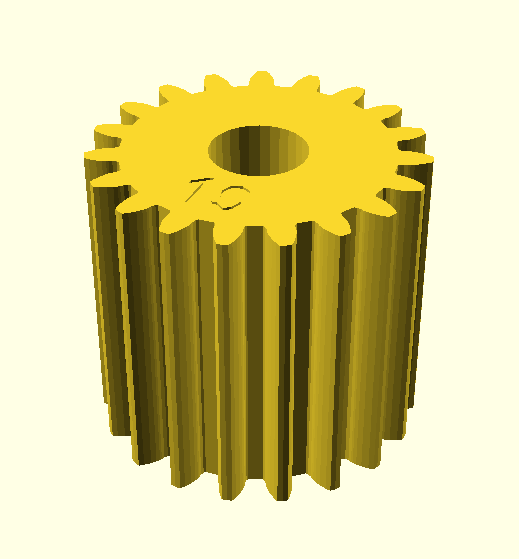](stl/19t-hole-thick.stl) | [19](stl/19t-hole-thick.stl) | | [Pinion thick (stardard)](stl/19t-hole-thick.stl) | Grendel
 | [19](stl/19t-tri-thick-bigger-hole.stl) | | [Pinion tri-flat thick large hole (stardard)](stl/19t-tri-thick-bigger-hole.stl) | Grendel
[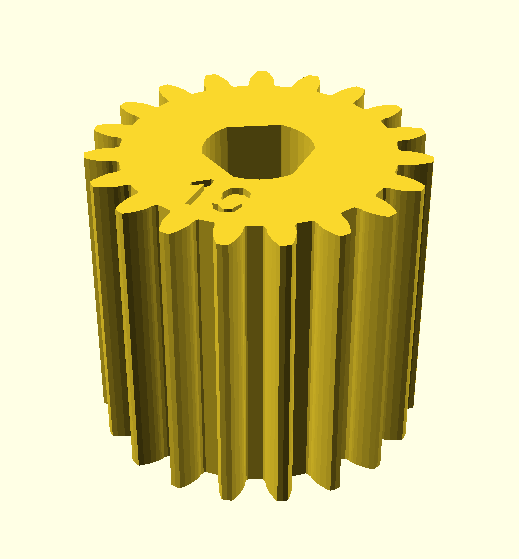](stl/19t-tri-thick-bigger-hole1.stl) | [19](stl/19t-tri-thick-bigger-hole1.stl) | | [Pinion tri-flat thick large hole (stardard)](stl/19t-tri-thick-bigger-hole1.stl) | Grendel
 | [19](stl/19t-tri-thick.stl) | | [Pinion tri-flat thick (stardard)](stl/19t-tri-thick.stl) | Grendel
 | [19](stl/26p3p.stl) | [26p3p](stl/26p3p.stl) | [Pinion](stl/26p3p.stl) | Grendel
[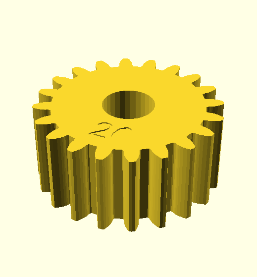](stl/20t-hole.stl) | [20](stl/20t-hole.stl) | [25l/26a](stl/20t-hole.stl) | [Pinion (stardard, early obsolete)](stl/20t-hole.stl) | Grendel
 | [21](stl/21t-hole.stl) | | [Pinion](stl/21t-hole.stl) | Grendel
[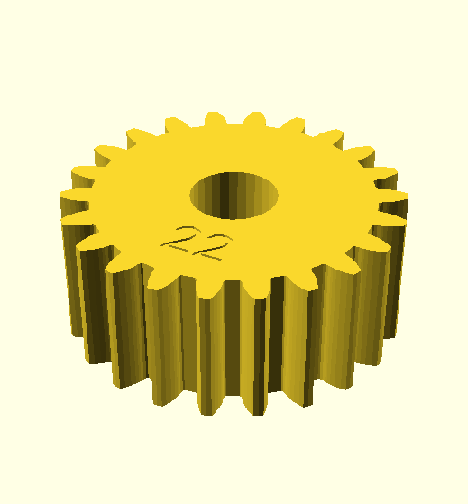](stl/22t-hole.stl) | [22](stl/22t-hole.stl) | [26f](stl/22t-hole.stl) | [Pinion](stl/22t-hole.stl) | Grendel
 | [23](stl/23t-hole.stl) | | [Pinion](stl/23t-hole.stl) | Grendel
 | [24](stl/24t-hole.stl) | [25p](stl/24t-hole.stl) | [Pinion](stl/24t-hole.stl) | Grendel
 | [25](stl/25-t-for-splined-boss.stl) | | [Pinion for splined boss](stl/25-t-for-splined-boss.stl) | Grendel
 | [25](stl/25t-hole.stl) | [26](stl/25t-hole.stl) | [Pinion (stardard)](stl/25t-hole.stl) | Grendel
 | [25](stl/25t-hole1.stl) | [26](stl/25t-hole1.stl) | [Pinion (stardard)](stl/25t-hole1.stl) | Grendel
 | [25](stl/25t-holegrub.stl) | [26](stl/25t-holegrub.stl) | [Pinion grub screw (stardard)](stl/25t-holegrub.stl) | Grendel
[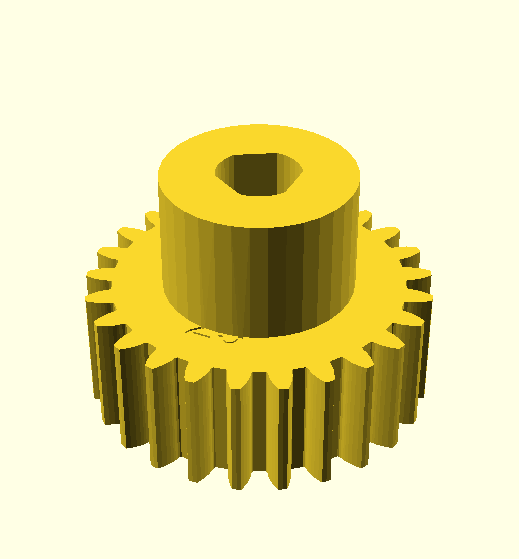](stl/25t-tri.stl) | [25](stl/25t-tri.stl) | | [Pinion tri-flat](stl/25t-tri.stl) | Grendel
[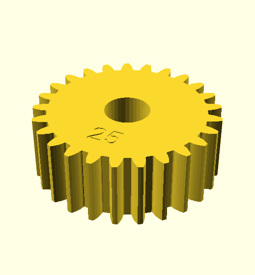](stl/25tthinhole.stl) | [25](stl/25tthinhole.stl) | | [Pinion thin](stl/25tthinhole.stl) | Grendel
 | [25](stl/25tthintri.stl) | | [Pinion tri-flat thin](stl/25tthintri.stl) | Grendel
 | [26](stl/26t-hole.stl) | [25q](stl/26t-hole.stl) | [Pinion](stl/26t-hole.stl) | Grendel
 | [27](stl/27t-hole.stl) | [25s](stl/27t-hole.stl) | [Pinion](stl/27t-hole.stl) | Grendel
[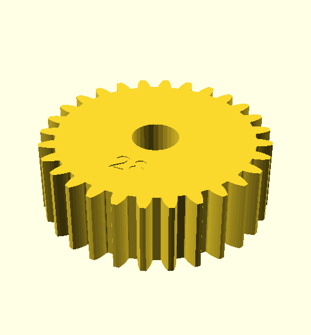](stl/28t-hole.stl) | [28](stl/28t-hole.stl) | [25c](stl/28t-hole.stl) | [Pinion](stl/28t-hole.stl) | Grendel
 | [29](stl/29t-hole.stl) | | [Pinion](stl/29t-hole.stl) | Grendel
 | [30](stl/30t-hole.stl) | [26k](stl/30t-hole.stl) | [Pinion](stl/30t-hole.stl) | Grendel
[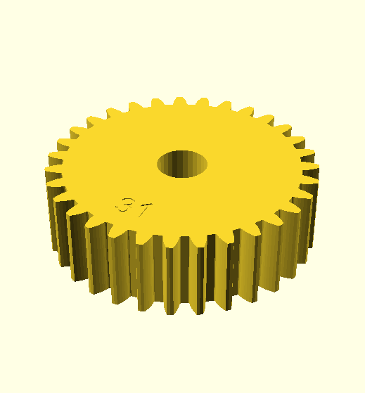](stl/31t-hole.stl) | [31](stl/31t-hole.stl) |  | [Pinion](stl/31t-hole.stl) | Grendel
 | [32](stl/32t-hole.stl) |  | [Pinion](stl/32t-hole.stl) | Grendel
[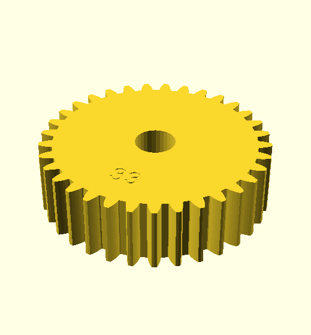](stl/33t-hole.stl) | [33](stl/33t-hole.stl) |  | [Pinion](stl/33t-hole.stl) | Grendel
[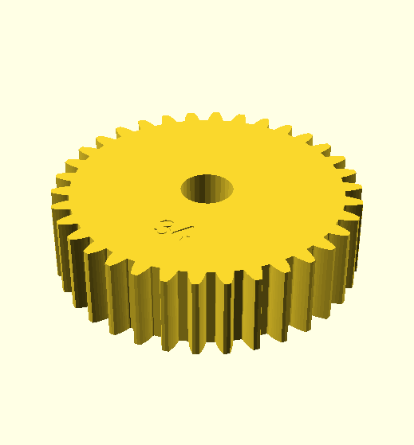](stl/34t-hole.stl) | [34](stl/34t-hole.stl) |  | [Pinion](stl/34t-hole.stl) | Grendel
 | [35](stl/35t-hole.stl) |  | [Pinion](stl/35t-hole.stl) | Grendel
 | [36](stl/36t-hole.stl) |  | [Gear](stl/36t-hole.stl) | Grendel
 | [37](stl/37t-hole.stl) | | [Gear](stl/37t-hole.stl) | Grendel
 |  | [31](stl/part-31-grub.stl) | [Gear grub screw](stl/part-31-grub.stl) | Grendel
[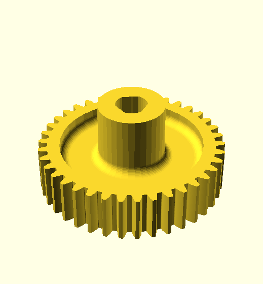](stl/part-31-tri-axle.stl) |  | [31](stl/part-31-tri-axle.stl) | [Gear tri-flat](stl/part-31-tri-axle.stl) | Grendel
 |  | [31](stl/part-31.stl) | [Gear](stl/part-31.stl) | Grendel
 | [38](stl/38-t-for-splined-boss.stl) | [31](stl/38-t-for-splined-boss.stl) | [Gear](stl/38-t-for-splined-boss.stl) | Grendel
[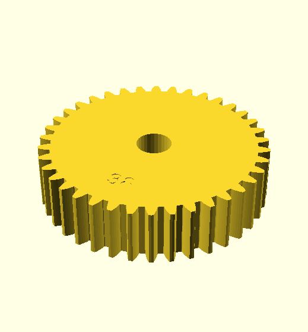](stl/38t-hole.stl) | [38](stl/38t-hole.stl) | [31](stl/38t-hole.stl) | [Gear (standard)](stl/38t-hole.stl) | Grendel
[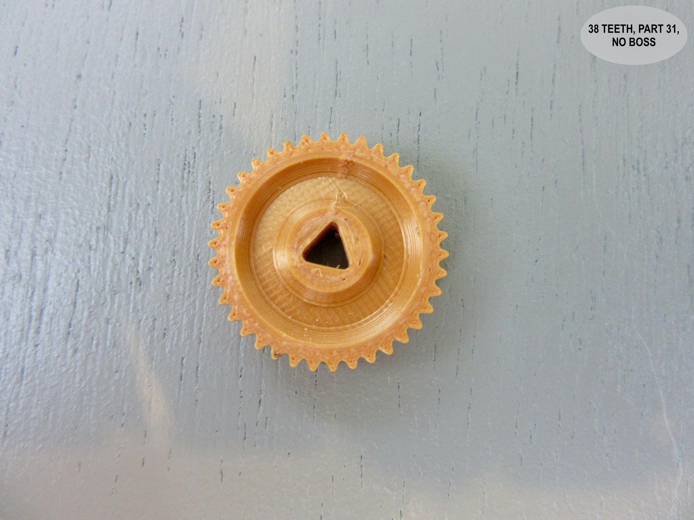](stl/38t-triflat.stl) | [38](stl/38t-trifla.tstl) | [31](stl/38t-triflat.stl) | [Gear (standard)](stl/38t-triflat.stl) | Tony Kirk
 | [39](stl/39t-hole.stl) |  | [Gear](stl/39t-hole.stl) | Grendel
 | [40](stl/40t-hole.stl) | [31](stl/40t-hole.stl) | [Gear (standard, early obsolete)](stl/40t-hole.stl) | Grendel
[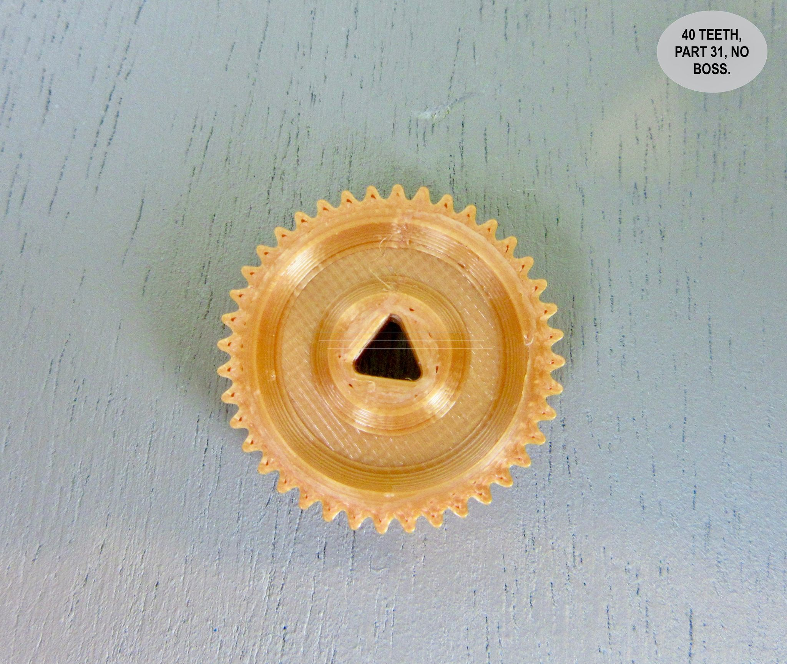](stl/40t-triflat.stl) | [40](stl/40t-trifla.tstl) | [31](stl/40t-triflat.stl) | [Gear (standard)](stl/40t-triflat.stl) | Tony Kirk
 | [41](stl/41t-hole.stl) |  | [Gear](stl/41t-hole.stl) | Grendel
 | [41](stl/41t-hole2.stl) |  | [Gear](stl/41t-hole2.stl) | Grendel
 | [42](stl/42t-hole.stl) |  | [Gear](stl/42t-hole.stl) | Grendel
 | [43](stl/43t-hole.stl) |  | [Gear](stl/43t-hole.stl) | Grendel
 | [44](stl/44t-hole.stl) |  | [Gear](stl/44t-hole.stl) | Grendel
 | [45](stl/45t-hole.stl) |  | [Gear](stl/45t-hole.stl) | Grendel
 | [46](stl/46t-hole.stl) |  | [Gear](stl/46t-hole.stl) | Grendel
 | [47](stl/47t-hole.stl) |  | [Gear](stl/47t-hole.stl) | Grendel
 | [48](stl/48t-hole.stl) |  | [Gear](stl/48t-hole.stl) | Grendel
 | [49](stl/49t-hole.stl) |  | [Gear](stl/49t-hole.stl) | Grendel
 | [50](stl/50-t-for-splined-boss.stl) | [27](stl/50-t-for-splined-boss.stl) | [Gear](stl/50-t-for-splined-boss.stl) | Grendel
 | [50](stl/50t-hole.stl) | [27](stl/50t-hole.stl) | [Gear (standard)](stl/50t-hole.stl) | Grendel
 | [50](stl/50tooth-hole.stl) | [27](stl/50tooth-hole.stl) | [Gear (standard)](stl/50tooth-hole.stl) | Grendel
 | [50](stl/50tooth-slot-for-nut.stl) | [27](stl/50tooth-slot-for-nut.stl) | [Gear boss + nuts](stl/50tooth-slot-for-nut.stl) | Grendel
 | [50](stl/50tooth-tri.stl) |  | [Gear tri-flat](stl/50tooth-tri.stl) | Grendel
[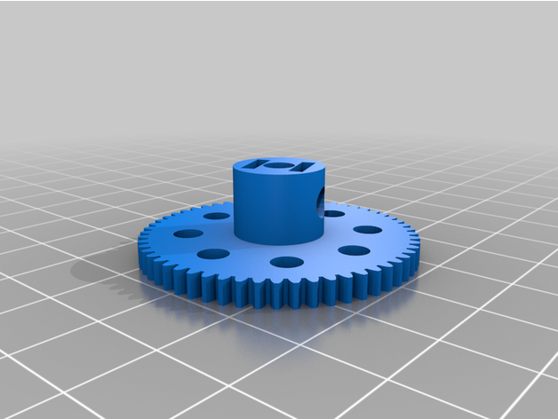](stl/57t.stl) | [57](stl/57t.stl) | [27a](stl/57t.stl) | [Gear (standard)](stl/57t.stl) | [Dave Burrell](https://www.thingiverse.com/thing:6082009)
[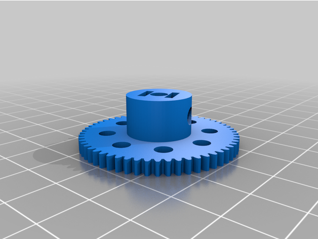](stl/57t-thick-boss.stl) | [57](stl/57t-thick-boss.stl) |  | [Gear thick boss](stl/57t-thick-boss.stl) | [Dave Burrell](https://www.thingiverse.com/thing:6082009)
[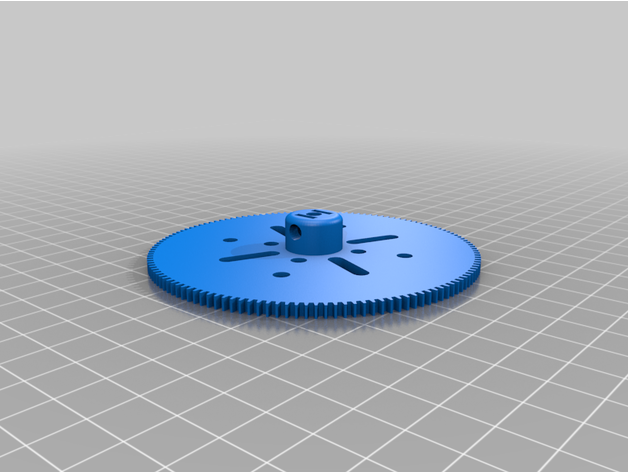](stl/133t.stl) | [133](stl/133t.stl) | [27b](stl/133t.stl) | [Gear (standard)](stl/133t.stl) | [Dave Burrell](https://www.thingiverse.com/thing:6083301)
