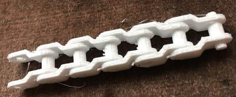

# Plastic/Junior Meccano Parts

Parts for the UK Plastic Meccano live here.

Image | Part | Description | Creator
----- | ---- | ----------- | -------
 | P74 | Chain link [(SCAD)](scad/P74_chain_link.sca) | 
 | P74 | Chain link [(SCAD)](scad/P74_chain_link-M2-6.scad) | 
 | P84 | 10 tooth sprocket [(SCAD)](scad/sprocket10T.scad) | Luciano Bernardi
 | P91 | Track link | 

