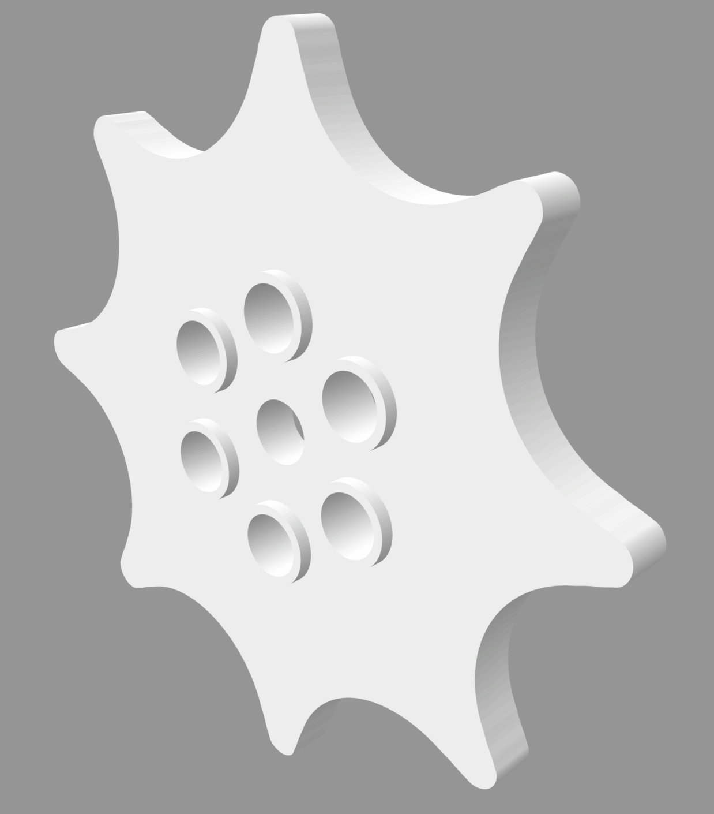
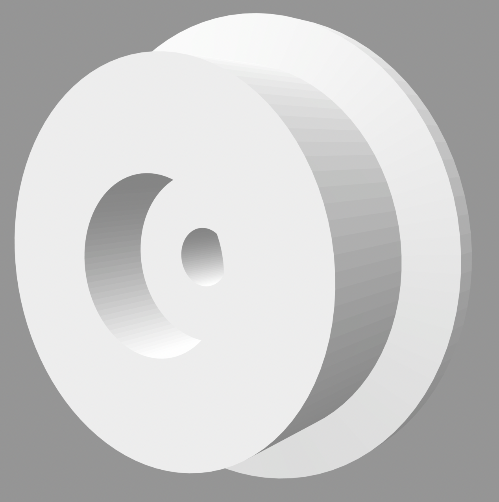
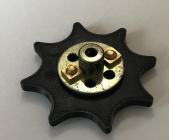

# Plastic Pinned Track Link and Extras

A pinned track link that doesn't rely on the build material being flexible
to join.  The design for the link and pin are absent.

The track sprocket bolts to a 1" bush wheel (part 518).  The rest are pairs
that make up the three track related wheels.

Image | Description
----- | -----------
 | [Track sprocket](stl/meccano-track-sprocket.stl)
 | [End roller (inside)](stl/end-roller-inside.stl)
 | [End roller (outside)](stl/end-roller-outside.stl)
 | [Idler roller (inside)](stl/idler-roller-inside.stl)
 | [Idler roller (outside)](stl/idler-roller-outside.stl)
 | [Road wheel (inside)](stl/road-wheel-inside.stl)
 | [Road wheel (outside)](stl/road-wheel-outside.stl)

