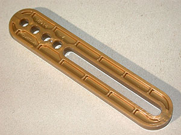
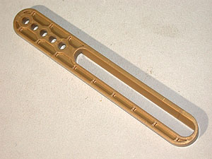
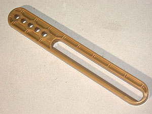

# Special Parts for the King Gidhorah Set

The Quantity column indicates the number containted in the set.  You should to print this many of the associated part.

Image | Part | Quantity | Description | By
:--- | :--- | :---: | :--- | :---
 | [B914](stl/B914.stl) | 2 | [Slotted Lever Bar, length 82 mm](stl/B914.stl) | Edmundo
 | [B915](stl/B915.stl) | 1 | [Tapered Slot Lever Bar, length 115 mm, left](stl/B915.stl) | Edmundo
 | [B916](stl/B916.stl) | 1 | [Tapered Slot Lever Bar, length 115 mm, right](stl/B916.stl) | Edmundo
