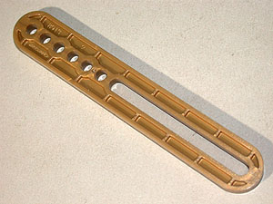
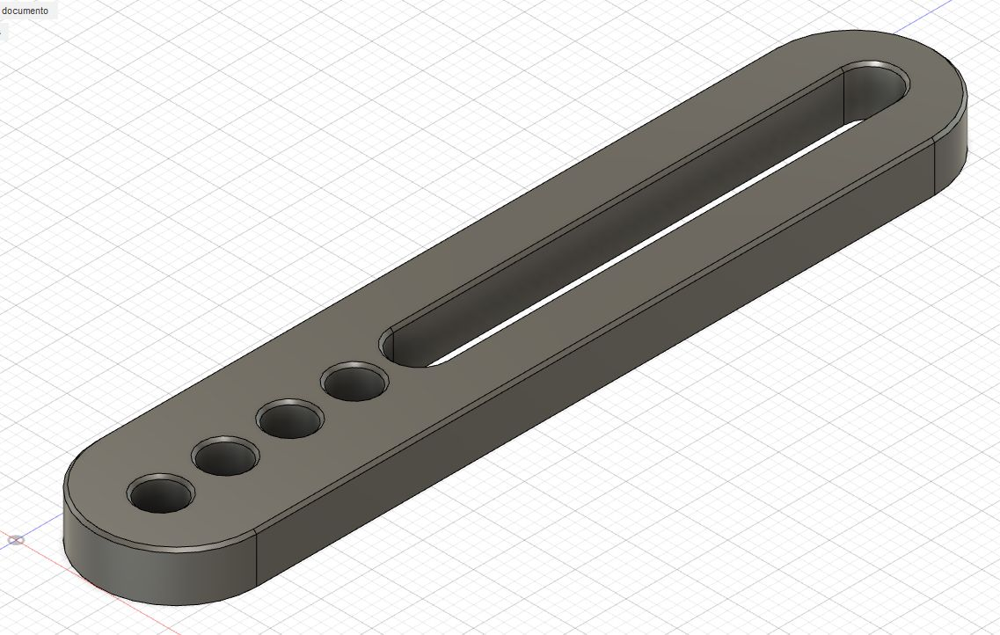
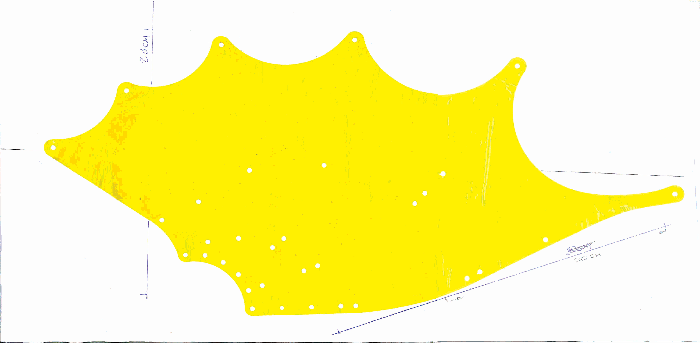

# Special Parts for the King Gidhorah Set

The quantity column indicates the number containted in the set.  You should 3D print this many of the associated part.
The manual for this set can be found at [Meccano Index](https://meccanoindex.co.uk/Mmanuals/Post-1981/Manuals-2/0528_2006-03.pdf).

- Part B913 has slightly chamfered edges to help avoid sagging during printing.
- Part B914 is available both with and without the chamfered edges.
- Part B921 is a template for creating the wings.  They are cellophane like using a transparent yellow membrane.

Image | Part | Quantity | Description | By
:--- | :--- | :---: | :--- | :---
 | [B913](stl/B913.stl) | 1 | [Slotted Lever Bar, length 100 mm](stl/B913.stl) ([Fusion3D](fusion3d/B913F.f3d)) | Edmundo
 | [B914](stl/B914.stl) | 2 | [Slotted Lever Bar, length 82 mm](stl/B914.stl) | Edmundo
 | B914 | 2 | Slotted Lever Bar, length 82 mm, chamfered ([Fusion3D](fusion3d/B914F.f3d)) | Edmundo
 | [B915](stl/B915.stl) | 1 | [Tapered Slot Lever Bar, length 115 mm, left](stl/B915.stl) | Edmundo
 | [B916](stl/B916.stl) | 1 | [Tapered Slot Lever Bar, length 115 mm, right](stl/B916.stl) | Edmundo
 | [B921](images/B921.jpg) | 2 | [Template for King Ghidorah Wing](images/B921.jpg) | Edmundo
