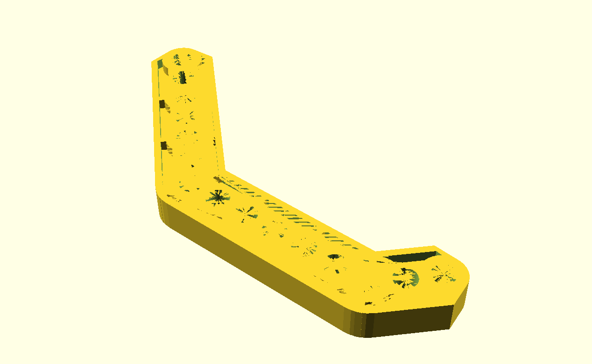
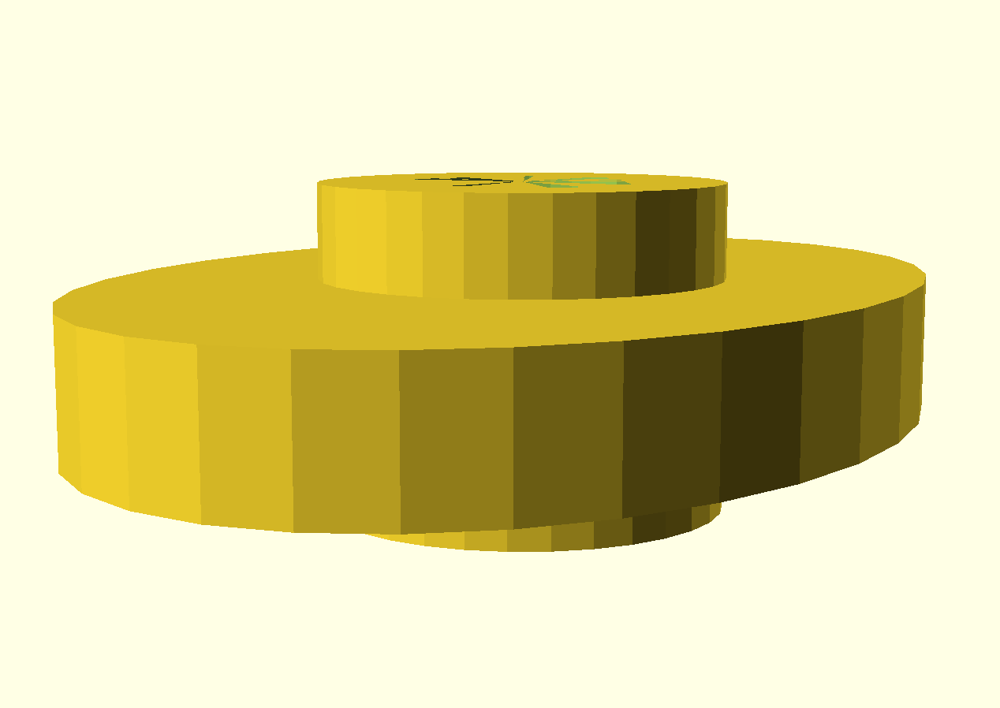

A collection of modern plastic parts. Some of these parts only show up in one or two sets, and then are never seen again. And while some of them are so specialized that you'd have a hard time finding alternate uses for them, some are general enough to be useful.

Image | Part | Description | By
----- | ---- | ----------- | --
 | B006 | Sprocket for rubber track intermittent rings [(SCAD)](scad/B006_sprocket.scad) | mecparts
 | B006 | Sprocket for rubber track continuous rings [(SCAD)](scad/B006_sprocket.scad) | mecparts
 | B006 | Sprocket for rubber track with 19 teeth interior [(DXF)](dxf/B006_19teeth_interior.dxf) | mecparts
 | B015 | Polygonal Bracket [(SCAD)](scad/B015_Polygonal_Bracket.scad) | mecparts
 | C962 | Cam [(SCAD)](scad/C962_cam.scad) | mecparts
