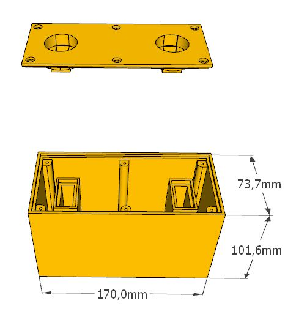

# Multikit Meccano Parts

Parts for the Meccano Multikits and similar live here.

Image | Part | Description | By
----- | ---- | ----------- | --
 | 320 | Multikit seat insert | Joseph Rimmer
 | | Blocksetter block shell ([SKP file](skp/crane-block-cover.skp)) | Edmundo Veiga
 | | Blocksetter block cover ([SKP file](skp/crane-block-cover.skp)) | Edmundo Veiga
