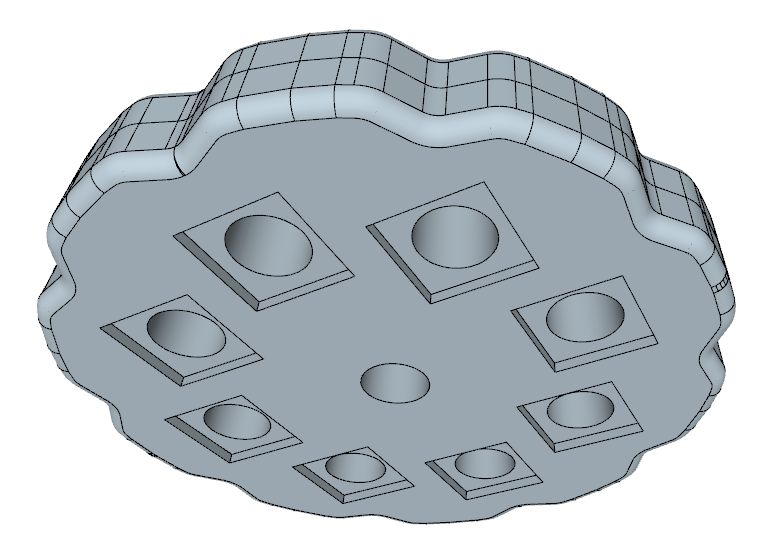
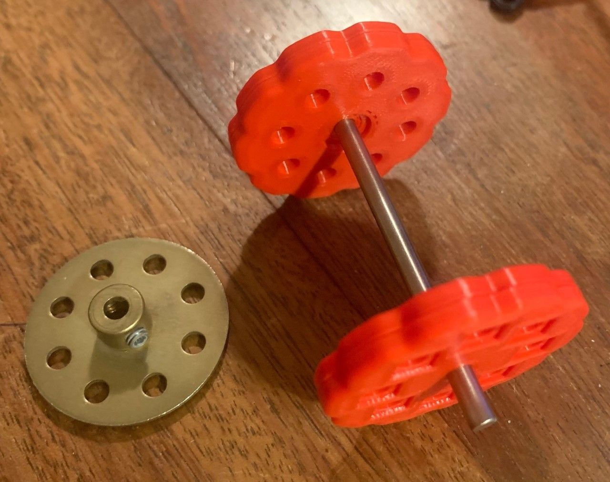
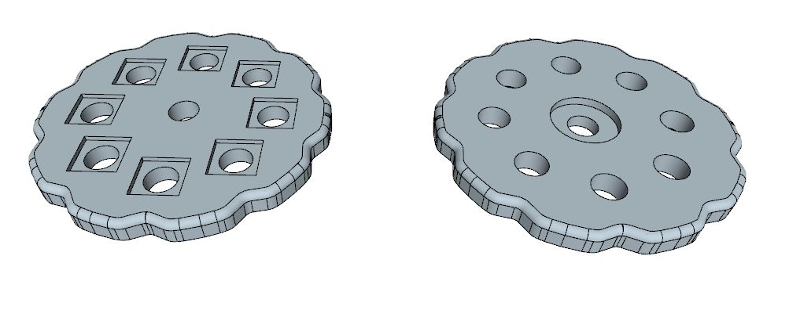

# Crawler track pieces

Image | Part | Description | Author
| :--- | --- | :--- | --- |
 | | Plastic Meccano like [pinned crawler track](pinned-track-link#readme) |
 | | [M1A1 style track](m1a1#readme) (spacer only) |
 | D320 | Sprocket for modern plastic track | Edmundo Veiga

