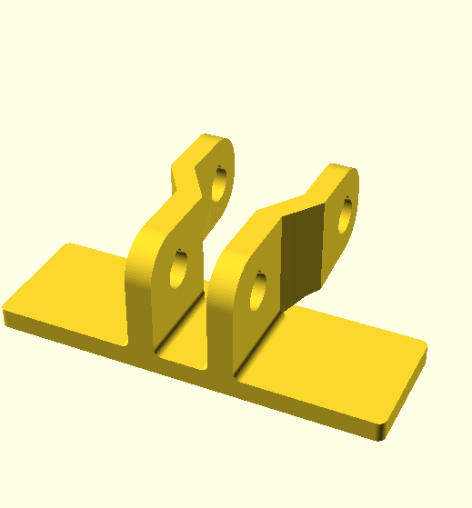
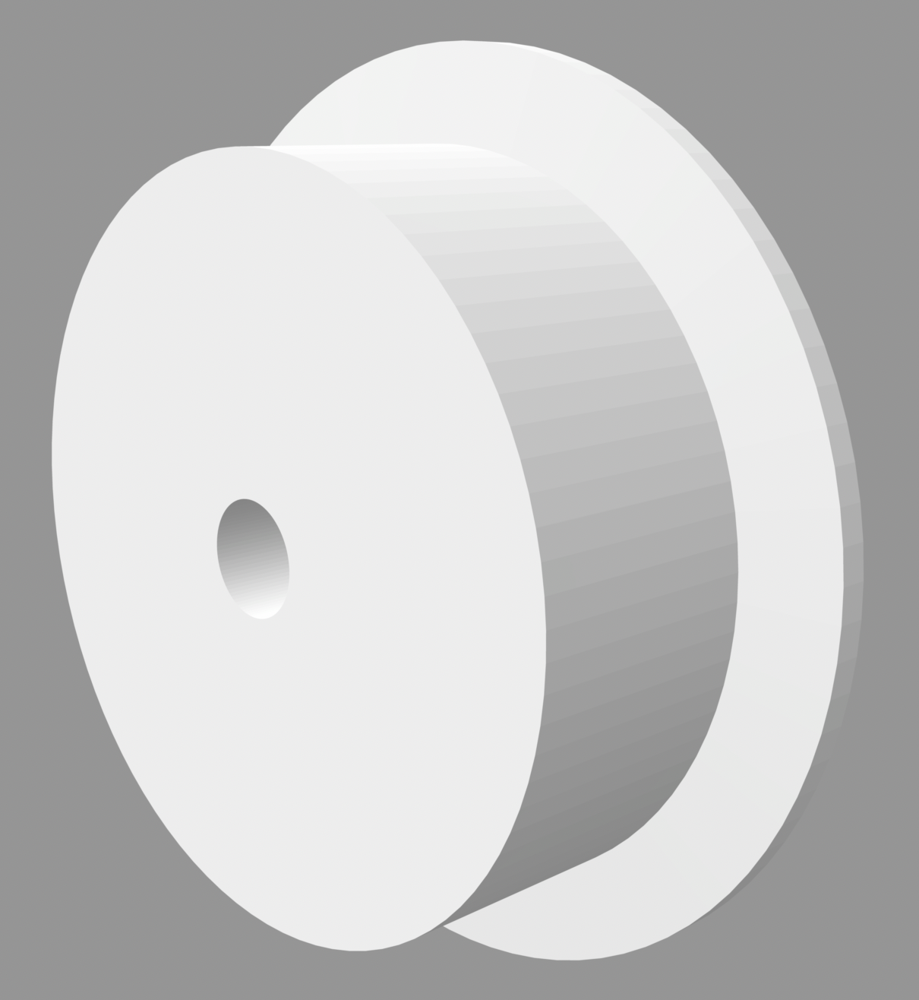
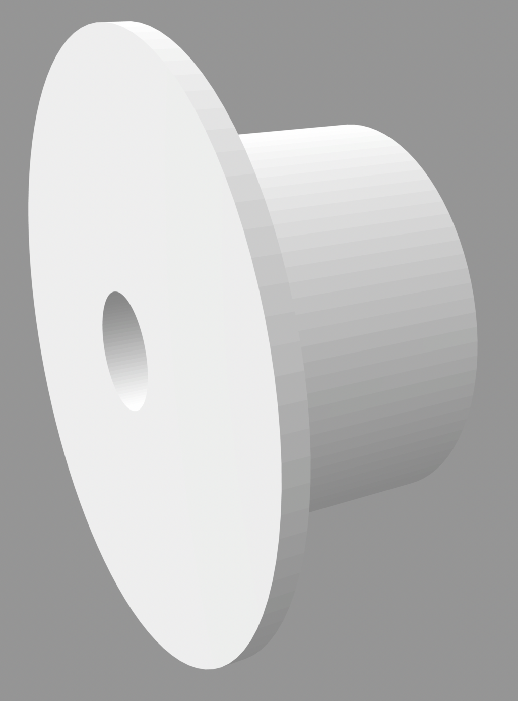
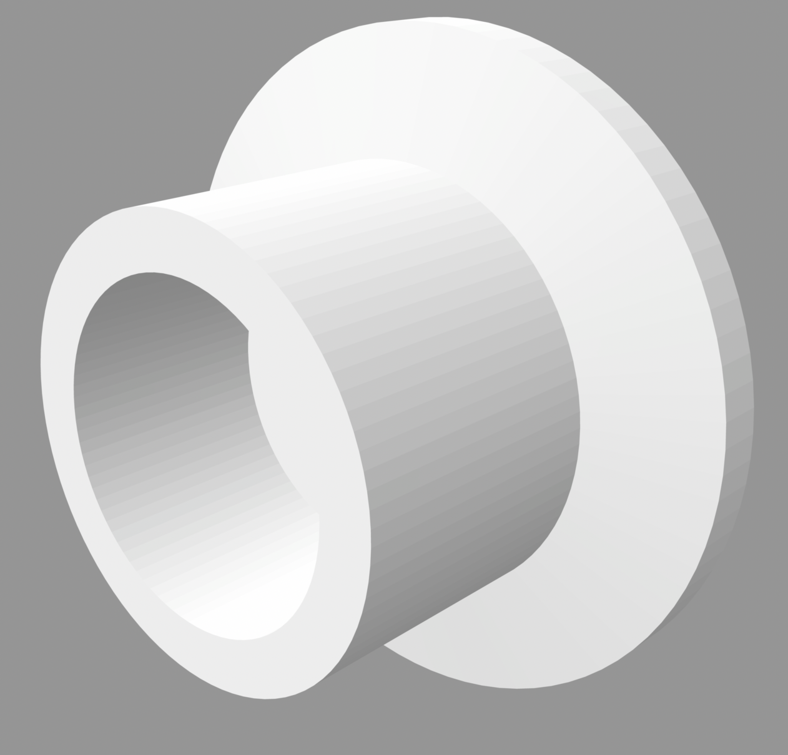
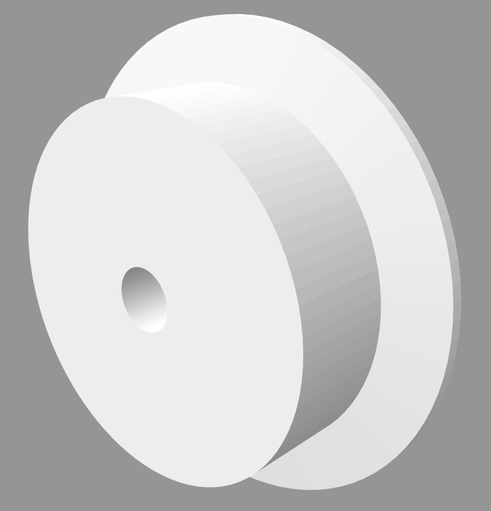
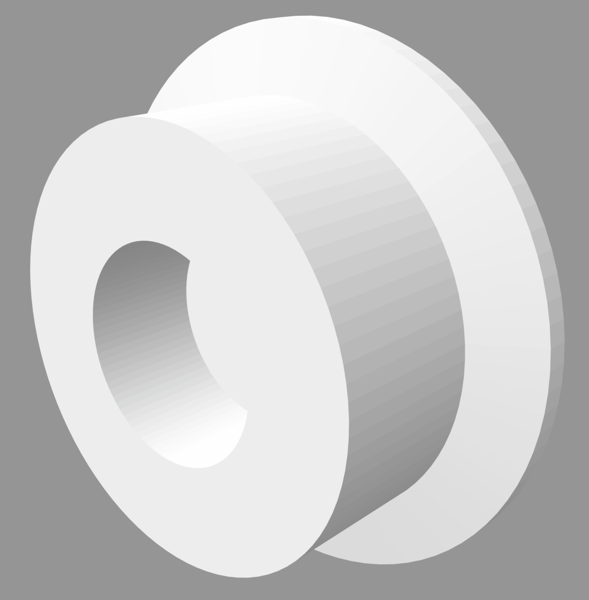
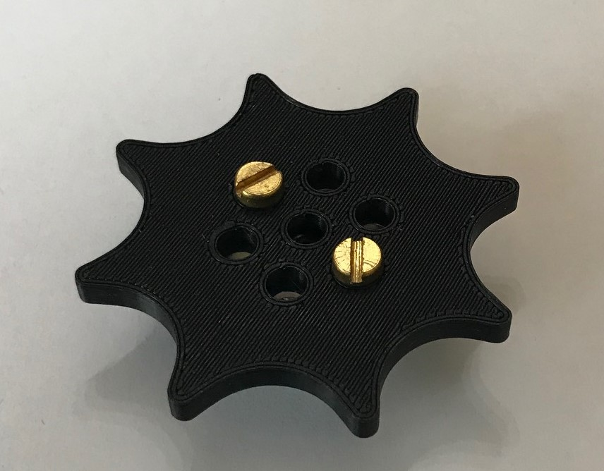

# Plastic Meccano pinned track pieces

Useful if material a bit brittle or as the joining link.  These links are joined
using a pin, so not flexing is required.

The star clip is push fit on the end of the posts and can be pulled off again. 
The posts are in a block so they do not fall over while printing. The title says twin but actually 8!
The link is shown with its supports. They break off easily and quite cleanly.

The track sprocket bolts to a 1" bush wheel (part 518).  The rest are pairs
that make up the three track related wheels.

There are additional track parts in the [Junior/Plastic Meccano section](../../junior#readme).

Image | Description
:--- | :---
 | [Track link](stl/track-link.stl)
 | [Posts](stl/twin-post.stl) x 8
 | [Star clip](stl/star-clip.stl)
 | [Track sprocket](stl/meccano-track-sprocket.stl)
 | [End roller (inside)](stl/end-roller-inside.stl)
 | [End roller (outside)](stl/end-roller-outside.stl)
 | [Idler roller (inside)](stl/idler-roller-inside.stl)
 | [Idler roller (outside)](stl/idler-roller-outside.stl)
 | [Road wheel (inside)](stl/road-wheel-inside.stl)
 | [Road wheel (outside)](stl/road-wheel-outside.stl)

