# A collection of tyres for pulleys.

Image | Part | Description | By
:--- | :--- | :--- | :---
[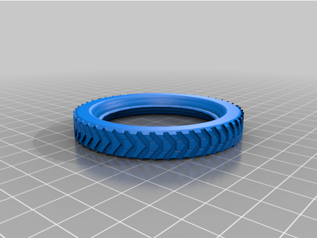](stl/142a_pattern_a.stl) | [142a](stl/142a_pattern_a.stl) | Tyre for 2" pulley pattern A | [PabloRomero87](https://www.thingiverse.com/thing:5021493)
[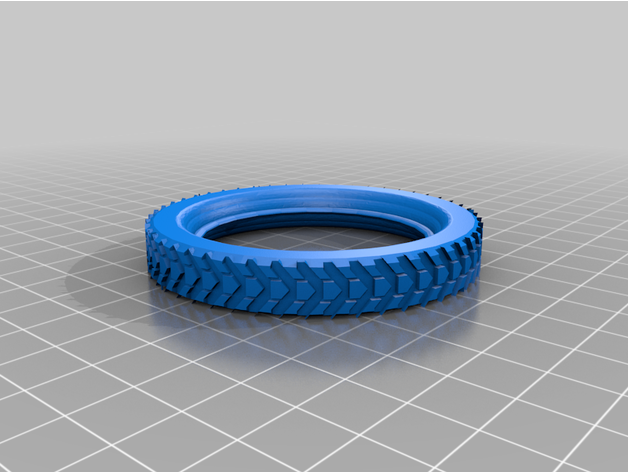](stl/142a_pattern_b.stl) | [142a](stl/142a_pattern_b.stl) | Tyre for 2" pulley pattern B | [PabloRomero87](https://www.thingiverse.com/thing:5021493)
[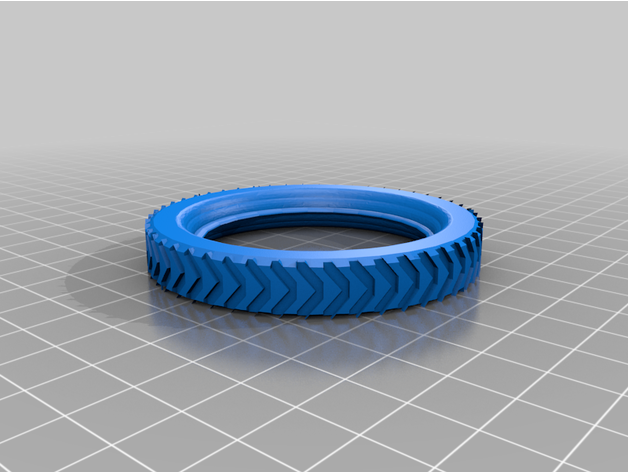](stl/142a_bevelled.stl) | [142a](stl/142a_bevelled.stl) | Tyre for 2" pulley bevelled | [PabloRomero87](https://www.thingiverse.com/thing:5021493)
 | [142b](stl/142b.stl) | Tyre for 3" pulley | [PabloRomero87](https://www.thingiverse.com/thing:4935158)
[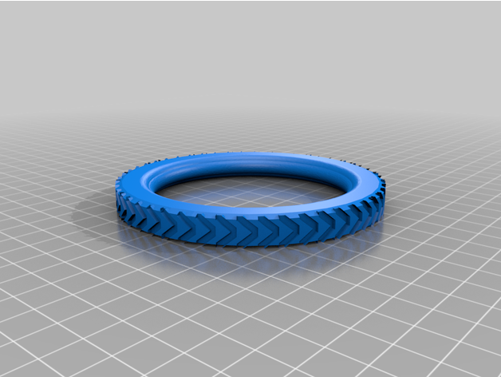](stl/142b_bevelled.stl) | [142b](stl/142b_bevelled.stl) | Tyre for 3" pulley bevelled | [PabloRomero87](https://www.thingiverse.com/thing:5021493)

[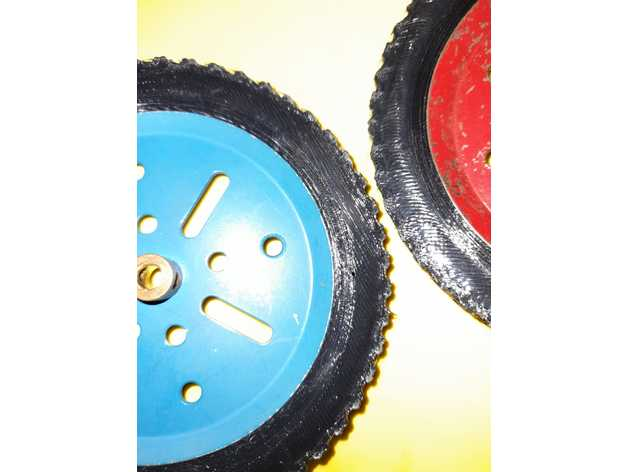](images/19b-1.jpg)
[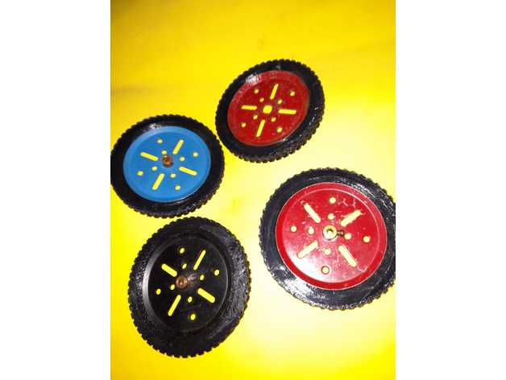](images/19b-2.jpg)
[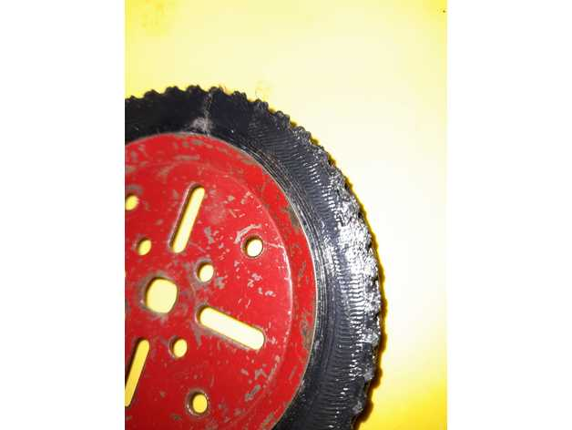](images/19b-3.jpg)
[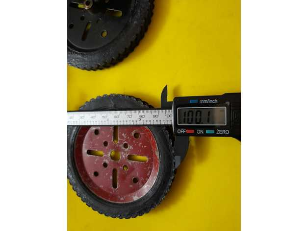](images/19b-4.jpg)
[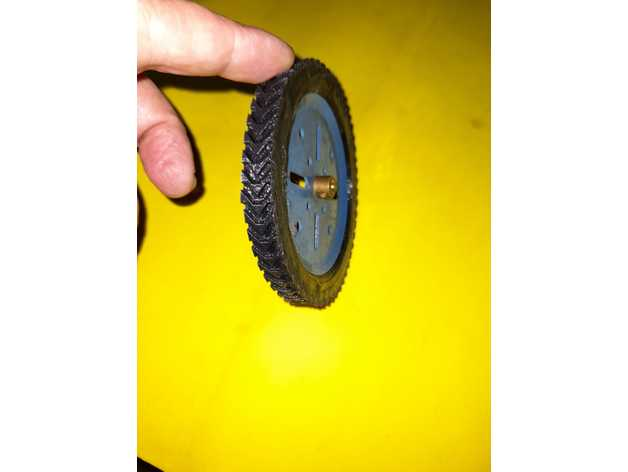](images/19b-5.jpg)
[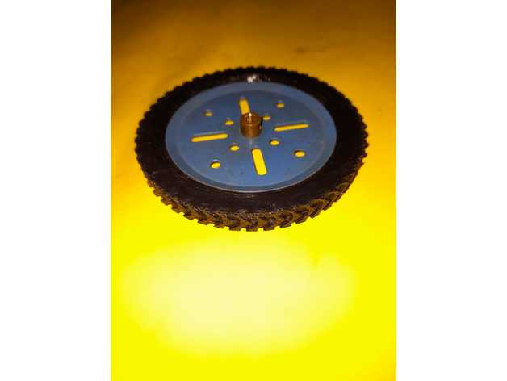](images/19b-6.jpg)
[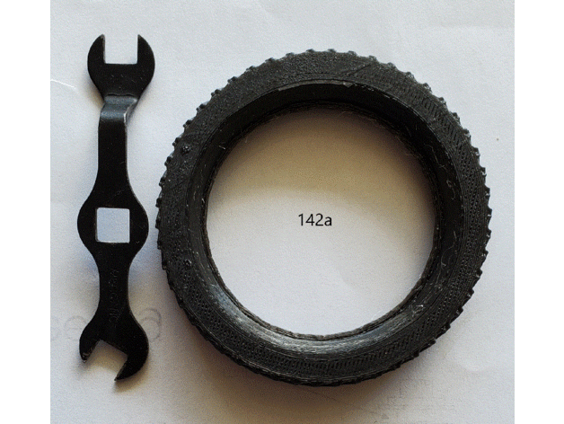](images/142a.gif)
[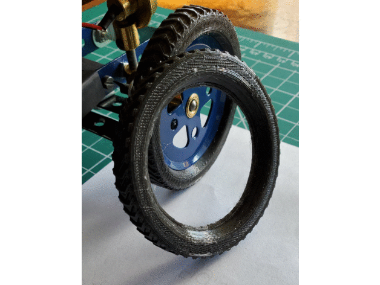](images/142a_side_view.gif)
[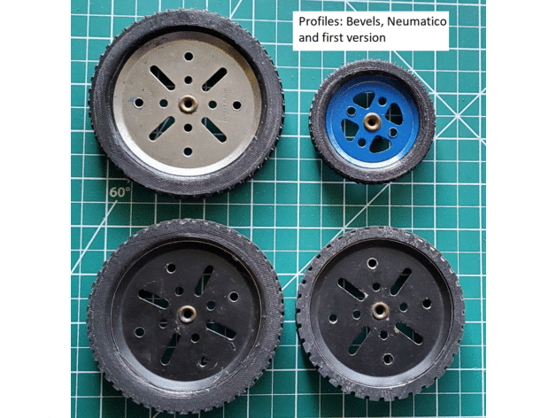](images/profile.gif)
[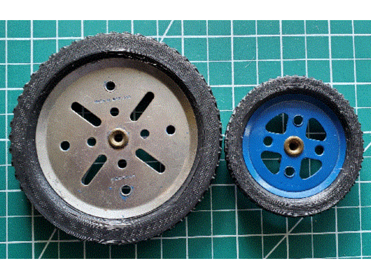](images/side_view.gif)
[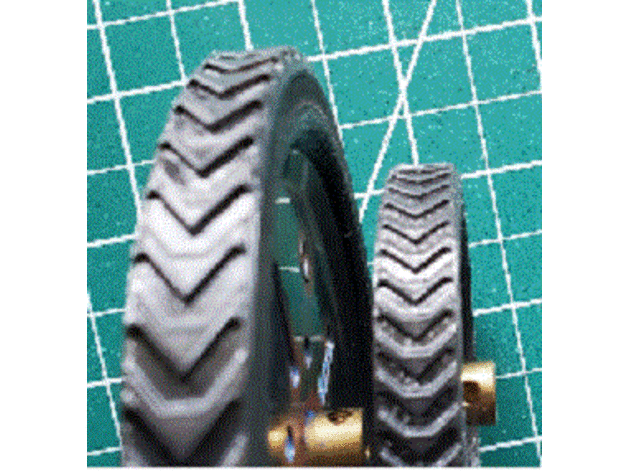](images/bevelled.gif)
[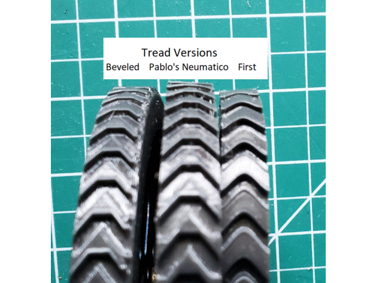](images/treads.gif)
