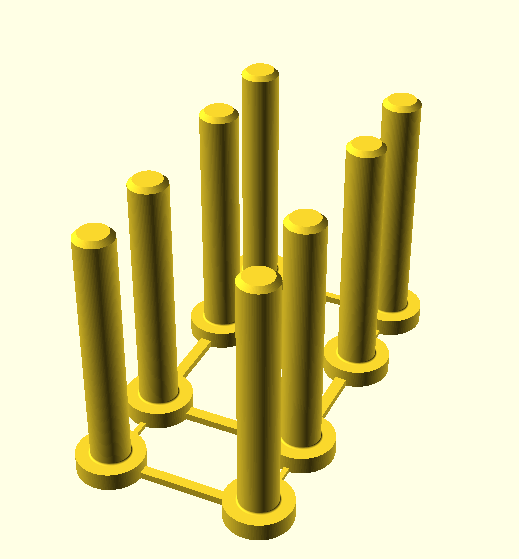

# Plastic Meccano pinned track pieces

Useful if material a bit brittle or as the joining link.

The star clip is push fit on the end of the posts and can be pulled off again. 
The posts are in a block so they do not fall over while printing. The title says twin but actually 8!
The link is shown with its supports. They break off easily and quite cleanly.

Image | Description
:--- | :---
 | [Track link](stl/track-link.stl)
 | [Posts](stl/twin-post.stl) x 8
 | [Star clip](stl/star-clip.stl)
