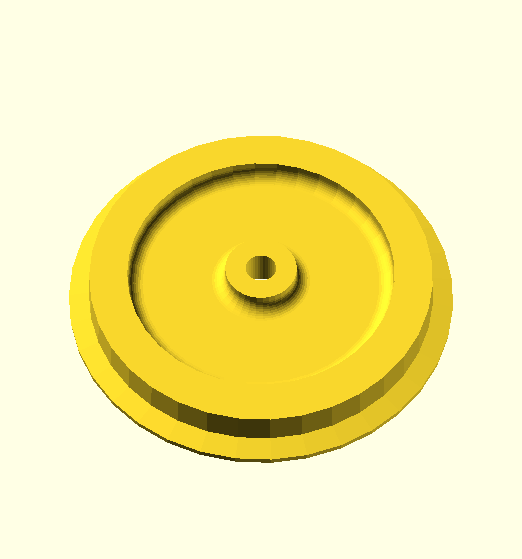
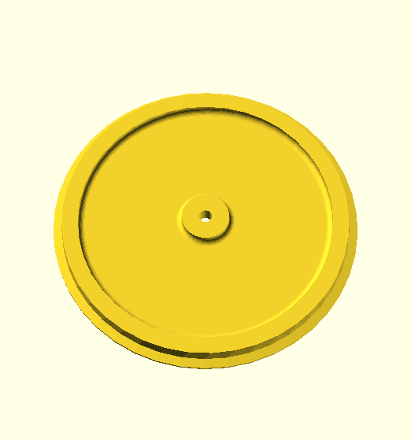

# This directory contains flanged wheels of varying kinds.

Image | Part Number | Description | by
----- | ----------- | ----------- | ---
 | 20 | [part 20 revised version](20-revised.stl) | Grendel
 | 20 | [Flanged Wheel 1&frac18;"](20-no-boss.stl) | Grendel
 | B167 | [part B167 round axle hole](B167-round.stl) | Grendel
 | B167 | [part B167 tri axle hole](B167-tri.stl) | Grendel
 | &nbsp; | [a 2" flanged railway wheel](flanged-wheel-2-inch.stl) | Grendel
 | &nbsp; | [2" flanged wheel with additional holes](flanged-wheel-2-inch-holes.stl) | Grendel
 | &nbsp; | [a 4" flanged railway wheel](flanged-wheel-4-inch.stl) | Grendel
